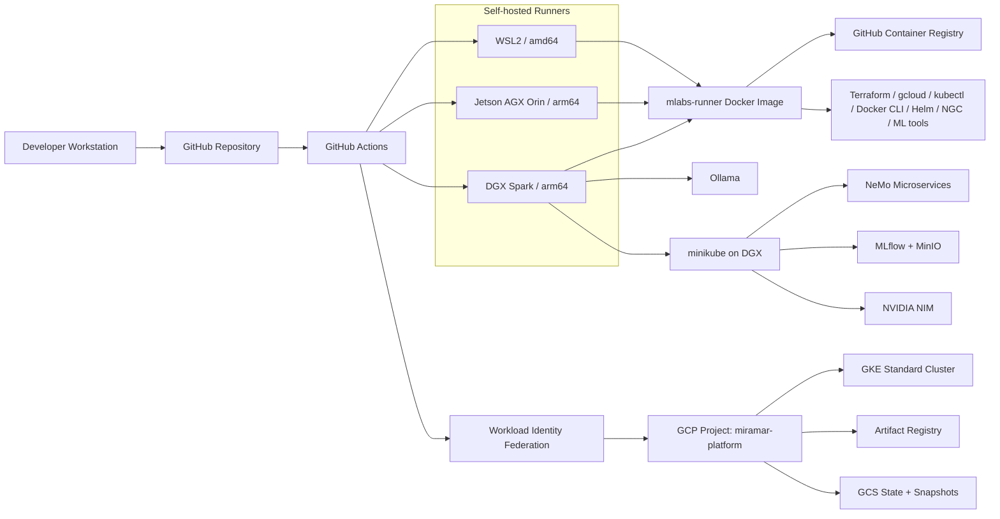

# miramar-platform-gcp

Hybrid On-Prem+GCP infrastructure and CI/CD tooling for the Miramar Labs AI Platform.

> **New here?** Read [SOWHAT.md](SOWHAT.md) — what this repo demonstrates and why it matters.

> **Dev Workflow:** [DEVELOPER.md](DEVELOPER.md) — branch workflow, PR process, testing strategies, and gotchas.

> **Docs Index:** [docs/index.md](docs/index.md) — source-of-truth map for architecture, workflows, WSL2, SSH, and runbooks.



[](https://github.com/miramar-labs-org/miramar-platform-gcp/actions/workflows/miramar-platform-create.yaml)
[](https://github.com/miramar-labs-org/miramar-platform-gcp/actions/workflows/miramar-platform-destroy.yaml)
[](https://github.com/miramar-labs-org/miramar-platform-gcp/actions/workflows/build-mlabs-runner.yml)
[](https://github.com/miramar-labs-org/miramar-platform-gcp/actions/workflows/gke-expand.yaml)
[](https://github.com/miramar-labs-org/miramar-platform-gcp/actions/workflows/gke-restore.yaml)
[](https://github.com/miramar-labs-org/miramar-platform-gcp/actions/workflows/gke-expand-gpu.yaml)
[](https://github.com/miramar-labs-org/miramar-platform-gcp/actions/workflows/gke-restore-gpu.yaml)
[](https://github.com/miramar-labs-org/miramar-platform-gcp/actions/workflows/find-gpu-capacity.yaml)
[](https://github.com/miramar-labs-org/miramar-platform-gcp/actions/workflows/toggle-minikube.yaml)
[](https://github.com/miramar-labs-org/miramar-platform-gcp/actions/workflows/deploy-nim.yaml)
[](https://github.com/miramar-labs-org/miramar-platform-gcp/actions/workflows/undeploy-nim.yaml)
[](https://github.com/miramar-labs-org/miramar-platform-gcp/actions/workflows/deploy-ollama.yaml)
[](https://github.com/miramar-labs-org/miramar-platform-gcp/actions/workflows/undeploy-ollama.yaml)
[](https://github.com/miramar-labs-org/miramar-platform-gcp/actions/workflows/provision-wsl2.yaml)
[](https://github.com/miramar-labs-org/miramar-platform-gcp/actions/workflows/verify-ssh-topology.yaml)
[](https://github.com/miramar-labs-org/miramar-platform-gcp/actions/workflows/unprovision-wsl2.yaml)

## Platform Overview

### Physical machines

On-premises machines acting as self-hosted GitHub Actions runners and general compute:

| Machine                     | OS                         | Arch            | CPU                                             | GPU                                                                              | VRAM           | CUDA | Runner label |
| --------------------------- | -------------------------- | --------------- | ----------------------------------------------- | -------------------------------------------------------------------------------- | -------------- | ---- | ------------ |
| Windows laptop              | Ubuntu 22.04 (WSL2)        | x86_64 / amd64  | AMD                                             | NVIDIA GeForce RTX 4060 — Ada Lovelace, 3072 CUDA cores, 96 Tensor Cores (sm_89) | 8 GB GDDR6     | 12.6 | `wsl2`       |
| NVIDIA DGX Spark 128GB      | DGX OS (Ubuntu 24.04)      | aarch64 / arm64 | 20-core Arm (10× Cortex-X925 + 10× Cortex-A725) | GB10 Superchip — Blackwell, 6144 CUDA cores, 192 Tensor Cores (sm_100, 5th-gen)  | 128 GB unified | 12.6 | `dgx`        |
| NVIDIA Jetson AGX Orin 64GB | Ubuntu 22.04 (JetPack 6.x) | aarch64 / arm64 | 12-core Cortex-A78AE                            | Ampere — 2048 CUDA cores, 64 Tensor Cores (sm_87)                                | 64 GB unified  | 12.6 | `agx`        |

All three machines run the [mlabs-runner](mlabs-runner/) Docker image — WSL2 pulls `linux/amd64`, DGX and Orin both pull `linux/arm64`. GPU access works the same way on both arm64 machines via the NVIDIA container runtime.

### Cloud infrastructure (GCP)

| Service                                     | Purpose                                                                       | Dashboard                                                                                                  |
| ------------------------------------------- | ----------------------------------------------------------------------------- | ---------------------------------------------------------------------------------------------------------- |
| GKE Standard cluster (`miramar-shared-gke`) | Shared Kubernetes cluster for platform workloads                              | [GKE console](https://console.cloud.google.com/kubernetes/list?project=miramar-platform)                   |
| Artifact Registry (`apps`)                  | Docker image registry for built application images                            | [GAR console](https://console.cloud.google.com/artifacts?project=miramar-platform)                         |
| GCS buckets                                 | Terraform state + GKE node pool snapshots (see [docs/gcp.md](docs/gcp.md))    | [GCS console](https://console.cloud.google.com/storage/browser?project=miramar-platform)                   |
| Workload Identity Federation                | Keyless auth from GitHub Actions to GCP — no long-lived service account keys  | [WIF console](https://console.cloud.google.com/iam-admin/workload-identity-pools?project=miramar-platform) |
| GCP project                                 | `miramar-platform` — single project for all resources                         | [Dashboard](https://console.cloud.google.com/home/dashboard?project=miramar-platform)                      |

### CI/CD

| Service             | Role                                                                                    | Link                                                                                  |
| ------------------- | --------------------------------------------------------------------------------------- | ------------------------------------------------------------------------------------- |
| GitHub Actions      | Workflow automation — build, test, deploy                                               | [Actions](https://github.com/orgs/miramar-labs-org/actions)                           |
| GHCR                | Docker image hosting for the runner image and future app images                         | [Packages](https://github.com/orgs/miramar-labs-org/packages)                         |
| Self-hosted runners | Jobs requiring GPU, local network access, or aarch64 run on the physical machines above | [Runners](https://github.com/organizations/miramar-labs-org/settings/actions/runners) |

GitHub Actions workflows authenticate to GCP keylessly via Workload Identity Federation. Access is restricted to repos under the `miramar-labs-org` org.

---

## Local DGX Stack

DGX Spark runs the local AI stack: minikube, NeMo Microservices, MLflow, NIM,
and Ollama. See [docs/dgx.md](docs/dgx.md) for workflow details and
[dgx/README.md](dgx/README.md) for host-level service notes.

Common tunnel:

```sh
ssh -L 8001:localhost:8001 \
    -L 8888:localhost:8888 \
    -L 5000:localhost:5000 \
    -L 11434:localhost:11434 \
    <user>@spark-79b7.local
```

Stack order: **Minikube Install -> NeMo Deploy -> MLflow Deploy -> NIM Deploy**.

---

## Operations Map

Detailed operational procedures live in focused docs:

| Area | Docs |
| --- | --- |
| GitHub secrets, variables, and host env vars | [docs/configuration.md](docs/configuration.md) |
| Self-hosted runner image and launch scripts | [docs/runners.md](docs/runners.md) |
| GCP bootstrap, Terraform, WIF, and state storage | [docs/gcp.md](docs/gcp.md) |
| Workflow catalog | [docs/workflows.md](docs/workflows.md) |
| DGX local AI stack | [docs/dgx.md](docs/dgx.md), [dgx/README.md](dgx/README.md) |
| WSL2 environments | [wsl2/README.md](wsl2/README.md), [wsl2/TECHNICAL.md](wsl2/TECHNICAL.md) |
| SSH topology | [docs/ssh-runbook.md](docs/ssh-runbook.md) |
| Shared DGX/WSL2 folder | [docs/shared.md](docs/shared.md) |

Common entry points:

| Task | Start here |
| --- | --- |
| Bootstrap GCP once | [docs/gcp.md](docs/gcp.md) |
| Launch local runners | [docs/runners.md](docs/runners.md) |
| Create/destroy platform | [docs/workflows.md](docs/workflows.md) |
| Scale GKE/GPU capacity | [docs/workflows.md](docs/workflows.md), [docs/gpu-quota-request.md](docs/gpu-quota-request.md) |
| Deploy DGX AI services | [docs/dgx.md](docs/dgx.md) |
| Provision WSL2 distros | [wsl2/README.md](wsl2/README.md) |
| Troubleshoot SSH | [docs/ssh-runbook.md](docs/ssh-runbook.md) |

## Contributing

Branch workflow, PR process, testing strategies, branch protection commands, and secrets setup: see [DEVELOPER.md](DEVELOPER.md).
