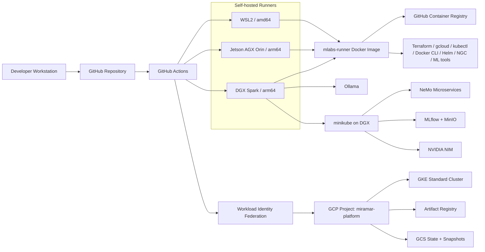

# miramar-platform-gcp

Hybrid On-Prem+GCP infrastructure and CI/CD tooling for the Miramar Labs AI Platform.

> **New here?** Read [SOWHAT.md](SOWHAT.md) — what this repo demonstrates and why it matters.

> **Dev Workflow:** [DEVELOPER.md](DEVELOPER.md) — branch workflow, PR process, testing strategies, and gotchas.



[](https://github.com/miramar-labs-org/miramar-platform-gcp/actions/workflows/miramar-platform-create.yaml)
[](https://github.com/miramar-labs-org/miramar-platform-gcp/actions/workflows/miramar-platform-destroy.yaml)
[](https://github.com/miramar-labs-org/miramar-platform-gcp/actions/workflows/build-mlabs-runner.yml)
[](https://github.com/miramar-labs-org/miramar-platform-gcp/actions/workflows/gke-expand.yaml)
[](https://github.com/miramar-labs-org/miramar-platform-gcp/actions/workflows/gke-restore.yaml)
[](https://github.com/miramar-labs-org/miramar-platform-gcp/actions/workflows/gke-expand-gpu.yaml)
[](https://github.com/miramar-labs-org/miramar-platform-gcp/actions/workflows/gke-restore-gpu.yaml)
[](https://github.com/miramar-labs-org/miramar-platform-gcp/actions/workflows/find-gpu-capacity.yaml)
[](https://github.com/miramar-labs-org/miramar-platform-gcp/actions/workflows/toggle-minikube.yaml)
[](https://github.com/miramar-labs-org/miramar-platform-gcp/actions/workflows/deploy-nim.yaml)
[](https://github.com/miramar-labs-org/miramar-platform-gcp/actions/workflows/undeploy-nim.yaml)
[](https://github.com/miramar-labs-org/miramar-platform-gcp/actions/workflows/deploy-ollama.yaml)
[](https://github.com/miramar-labs-org/miramar-platform-gcp/actions/workflows/undeploy-ollama.yaml)
[](https://github.com/miramar-labs-org/miramar-platform-gcp/actions/workflows/provision-wsl2.yaml)
[](https://github.com/miramar-labs-org/miramar-platform-gcp/actions/workflows/verify-ssh-topology.yaml)
[](https://github.com/miramar-labs-org/miramar-platform-gcp/actions/workflows/unprovision-wsl2.yaml)

## Platform Overview

### Physical machines

On-premises machines acting as self-hosted GitHub Actions runners and general compute:

| Machine | OS | Arch | CPU | GPU | VRAM | CUDA | Runner label |
|---|---|---|---|---|---|---|---|
| Windows laptop | Ubuntu 22.04 (WSL2) | x86_64 / amd64 | AMD | NVIDIA GeForce RTX 4060 — Ada Lovelace, 3072 CUDA cores, 96 Tensor Cores (sm_89) | 8 GB GDDR6 | 12.6 | `wsl2` |
| NVIDIA DGX Spark 128GB | DGX OS (Ubuntu 24.04) | aarch64 / arm64 | 20-core Arm (10× Cortex-X925 + 10× Cortex-A725) | GB10 Superchip — Blackwell, 6144 CUDA cores, 192 Tensor Cores (sm_100, 5th-gen) | 128 GB unified | 12.6 | `dgx` |
| NVIDIA Jetson AGX Orin 64GB | Ubuntu 22.04 (JetPack 6.x) | aarch64 / arm64 | 12-core Cortex-A78AE | Ampere — 2048 CUDA cores, 64 Tensor Cores (sm_87) | 64 GB unified | 12.6 | `agx` |

All three machines run the [mlabs-runner](mlabs-runner/) Docker image — WSL2 pulls `linux/amd64`, DGX and Orin both pull `linux/arm64`. GPU access works the same way on both arm64 machines via the NVIDIA container runtime.

### Cloud infrastructure (GCP)

| Service | Purpose | Dashboard |
|---|---|---|
| GKE Standard cluster (`miramar-shared-gke`) | Shared Kubernetes cluster for platform workloads | [GKE console](https://console.cloud.google.com/kubernetes/list?project=miramar-platform) |
| Artifact Registry (`apps`) | Docker image registry for built application images | [GAR console](https://console.cloud.google.com/artifacts?project=miramar-platform) |
| GCS buckets | Terraform state + GKE node pool snapshots (see [Storage](#gcp-storage) below) | [GCS console](https://console.cloud.google.com/storage/browser?project=miramar-platform) |
| Workload Identity Federation | Keyless auth from GitHub Actions to GCP — no long-lived service account keys | [WIF console](https://console.cloud.google.com/iam-admin/workload-identity-pools?project=miramar-platform) |
| GCP project | `miramar-platform` — single project for all resources | [Dashboard](https://console.cloud.google.com/home/dashboard?project=miramar-platform) |

### CI/CD

| Service | Role | Link |
|---|---|---|
| GitHub Actions | Workflow automation — build, test, deploy | [Actions](https://github.com/orgs/miramar-labs-org/actions) |
| GHCR | Docker image hosting for the runner image and future app images | [Packages](https://github.com/orgs/miramar-labs-org/packages) |
| Self-hosted runners | Jobs requiring GPU, local network access, or aarch64 run on the physical machines above | [Runners](https://github.com/organizations/miramar-labs-org/settings/actions/runners) |

GitHub Actions workflows authenticate to GCP keylessly via Workload Identity Federation. Access is restricted to repos under the `miramar-labs-org` org.

---

## MLflow (DGX)

MLflow runs in minikube (`mlflow-system` namespace, `svc/mlflow-tracking`). The `mlflow-portfwd.service` systemd service keeps a `kubectl port-forward` to port `5000` running automatically — see [dgx/systemd/](dgx/systemd/).

Access the UI by opening an SSH tunnel from your laptop:

```sh
ssh -L 5000:localhost:5000 <user>@spark-79b7.local
```

Then open **[http://localhost:5000](http://localhost:5000)** in your browser.

### [MLflow Deploy](.github/workflows/deploy-mlflow.yaml)

Deploys MLflow + MinIO into the `mlflow-system` namespace on the DGX minikube cluster. Integrates MLflow with the NeMo Microservices postgres as its backend store. Triggered automatically after a successful **NeMo Deploy** run, or manually via `workflow_dispatch`. NeMo must be deployed before running this.

```
Actions → MLflow Deploy → Run workflow
```

### [MLflow Undeploy](.github/workflows/undeploy-mlflow.yaml)

Removes MLflow and MinIO and deletes the `mlflow-system` namespace entirely.

```
Actions → MLflow Undeploy → Run workflow
```

---

## minikube (DGX)

The DGX runs a minikube cluster with the ingress, dashboard, and metrics-server addons enabled. The `dashboard.service` systemd service keeps a `kubectl proxy` running on port `8001` automatically — see [dgx/systemd/](dgx/systemd/). Cluster lifecycle is managed via GHA workflows (**Minikube Install**, **Minikube Uninstall**, **Minikube Toggle**) — see [dgx/minikube/](dgx/minikube/).

Open an SSH tunnel from your laptop:

```sh
ssh -L 8001:localhost:8001 <user>@spark-79b7.local
```

Open the dashboard at **[http://localhost:8001/api/v1/namespaces/kubernetes-dashboard/services/http:kubernetes-dashboard:/proxy/](http://localhost:8001/api/v1/namespaces/kubernetes-dashboard/services/http:kubernetes-dashboard:/proxy/)**.

**DGX stack deployment order:** Minikube Install → NeMo Deploy → MLflow Deploy → NIM Deploy

---

## GitHub Secrets & Variables

### Org-level secrets — [miramar-labs-org settings](https://github.com/organizations/miramar-labs-org/settings/secrets/actions)

| Secret | Value | Purpose |
|---|---|---|
| `WIF_PROVIDER` | output of `bootstrap-miramar-platform.zsh` | WIF provider resource path — shared by all repos for GCP auth |
| `HF_TOKEN` | Hugging Face API token | Injected into workflow steps via `${{ secrets.HF_TOKEN }}` — no longer set on individual machines |
| `NVIDIA_API_KEY` | NVIDIA NGC API key | Required by NeMo Microservices and NIM workflows |
| `DGX_HOST_SSH_KEY` | Private SSH key (Ed25519) | Key used to SSH into the DGX host from runners; matching public key must be in `~/.ssh/authorized_keys` for `DGX_HOST_USER` on the DGX |
| `ORIN_HOST_SSH_KEY` | Private SSH key (Ed25519) | Key used to SSH into the Orin host from the agx runner container (via `localhost:22` — container uses `--network=host`); matching public key must be in `~/.ssh/authorized_keys` for `aaron` on Orin. Use Orin's own `~/.ssh/id_ed25519` and self-authorize it. |
| `DGX_SMB_PASSWORD` | Samba password for the DGX `aaron` user | Used by **Setup Shared SSH Store** (writes `.smbcredentials` on Orin — one-time admin op). **Not needed by WSL2 Provision** — credentials are baked into the template by `rebuild-template.ps1`. |
| `DGX_MINIKUBE_KUBECONFIG` | base64-encoded kubeconfig | Written by **Minikube Install**; used by minikube workflows to reach the DGX cluster |

### Repo-level secrets — [miramar-platform-gcp settings](https://github.com/miramar-labs-org/miramar-platform-gcp/settings/secrets/actions)

| Secret | Value | Purpose |
|---|---|---|
| `GCP_SERVICE_ACCOUNT` | `gh-gke-cluster-ops@miramar-platform.iam.gserviceaccount.com` | Cluster-ops SA — used by platform lifecycle workflows |
| `WSL2_HOST` | hostname or IP of the MSI Windows laptop | SSH target for WSL2 workflows |
| `WSL2_HOST_USER` | Windows SSH user | SSH login for WSL2 workflows |
| `WSL2_HOST_SSH_KEY` | Private SSH key | Key used to SSH into Windows from runners; matching public key in `C:\ProgramData\ssh\administrators_authorized_keys` |

### Org-level variables — [miramar-labs-org settings](https://github.com/organizations/miramar-labs-org/settings/variables/actions)

Available to all repos via `${{ vars.* }}`. GCP vars are **synced from `gcp/terraform/terraform.tfvars`** — do not edit directly; run `scripts/gha/sync-github-tf-vars.sh` after changing tfvars. Lab host vars are set manually.

| Variable | Value | Notes |
|---|---|---|
| `GCP_PROJECT_ID` | `miramar-platform` | synced from tfvars |
| `GKE_CLUSTER_NAME` | `miramar-shared-gke` | synced from tfvars |
| `GKE_ZONE` | `us-central1-b` | synced from tfvars |
| `GCP_REGION` | `us-central1` | synced from tfvars |
| `GAR_REPO` | `apps` | synced from tfvars |
| `GKE_STATE_BUCKET` | `miramar-platform-cluster-state` | set manually — not in tfvars |
| `DGX_HOST` | `spark-79b7.local` | set manually — mDNS hostname of the DGX Spark |
| `DGX_HOST_USER` | `aaron` | set manually — SSH user on the DGX host |
| `MLFLOW_TRACKING_URI` | `http://localhost:5000` | set manually — used by ML workflows |

---

## Required Environment Variables

Two GitHub classic PATs must be set as environment variables on each machine. Create them at [github.com/settings/tokens](https://github.com/settings/tokens) → **Generate new token (classic)**.

| Variable | Scope required | Purpose |
|---|---|---|
| `GITHUB_ORG_GHCR_PAT` | `read:packages` | Pull the `mlabs-runner` image from GHCR |
| `GITHUB_ORG_ADMIN_PAT` | `admin:org` | Manage self-hosted runners (list, unregister, clean deregistration on shutdown) |

Add to `~/.bashrc` or `~/.zshrc` on each machine:

```sh
export GITHUB_ORG_GHCR_PAT=ghp_...
export GITHUB_ORG_ADMIN_PAT=ghp_...
```

`HF_TOKEN` is stored as a GitHub org secret and injected by workflows — it does not need to be set on individual machines.

---

## GHA Self-Hosted Runners

Docker-based GitHub Actions runners for self-hosted machines. Supports `amd64` (x86_64) and `arm64` (aarch64) via a single multi-arch image.

### Image

Built and pushed to GHCR by the [build-mlabs-runner workflow](.github/workflows/build-mlabs-runner.yml) on every push to `main` that touches `mlabs-runner/**`.

| Image | Architectures |
|---|---|
| [`ghcr.io/miramar-labs-org/mlabs-runner:latest`](https://github.com/orgs/miramar-labs-org/packages/container/package/mlabs-runner) | `linux/amd64`, `linux/arm64` |

Docker automatically pulls the correct variant for the host architecture.

**Base:** `nvidia/cuda:12.6.3-cudnn-runtime-ubuntu22.04` — CUDA 12.6 is available inside the container on both machines (RTX 4060 on WSL2, GB10 on DGX). The launch script passes `--gpus all` automatically.

**Pre-installed tools:**

| Category | Packages |
|---|---|
| CI/CD | `docker-cli`, `kubectl`, `gcloud`, `terraform`, `gh`, `helm`, `ngc`, `make`, `openssh-client`, `zstd` |
| PyTorch | `torch`, `torchvision`, `torchaudio` — CUDA 12.6 wheels (amd64: pytorch.org/whl/cu126; arm64: standard PyPI) |
| HuggingFace | `transformers`, `diffusers`, `accelerate`, `peft`, `optimum`, `sentence-transformers`, `timm`, `huggingface_hub`, `evaluate`, `datasets` |
| ML tooling | `mlflow`, `tensorboard`, `bitsandbytes`, `onnx`, `scikit-learn`, `boto3`, `numpy`, `scipy`, `pandas`, `einops` |
| Audio/video | `ffmpeg`, `libsndfile1`, `sox` |

Terraform is installed directly in the image via the Hashicorp apt repo — the `hashicorp/setup-terraform` GitHub Actions action (which requires Node.js) is not used.

To verify GPU access after pulling a new image:
```sh
docker run --rm --gpus all ghcr.io/miramar-labs-org/mlabs-runner:latest \
  python -c "import torch; print(torch.cuda.is_available(), torch.cuda.get_device_name(0))"
```

### Prerequisites

- Docker installed on the host machine
- A **runner registration token** is fetched automatically via `GITHUB_ORG_ADMIN_PAT`. To override, pass `--token` manually:
  - **Org-level:** https://github.com/organizations/miramar-labs-org/settings/actions/runners/new
  - **Repo-level:** `https://github.com/miramar-labs-org/<repo>/settings/actions/runners/new`
- **`GITHUB_ORG_GHCR_PAT`** set as an environment variable — see [Required Environment Variables](#required-environment-variables) above.

### Launch

The [launch-runner.sh](scripts/gha/launch-runner.sh) script pulls the multi-arch image and runs the correct variant for the host. It is **idempotent** — if the container is already running it prints its status and exits cleanly.

```sh
# Org-level runner, foreground (Ctrl+C to stop and deregister)
# Machine label is auto-detected: wsl2 (amd64), dgx or agx (arm64 via /proc/device-tree/model)
./scripts/gha/launch-runner.sh

# Repo-level runner, detached
./scripts/gha/launch-runner.sh \
  --repo miramar-platform-gcp \
  --detach

# Ephemeral (deregisters after one job)
./scripts/gha/launch-runner.sh --ephemeral
```

**All options:**

| Flag | Default | Description |
|---|---|---|
| `--token` | *(auto-fetched)* | Runner registration token — fetched via `GITHUB_ORG_ADMIN_PAT` if not supplied |
| `--name` | hostname | Runner display name |
| `--labels` | `wsl2` / `dgx` / `agx` — auto-detected from arch and `/proc/device-tree/model` | Comma-separated runner labels |
| `--repo` | *(unset — org-level)* | Scope to a specific repo (`owner/repo`) |
| `--group` | `Default` | Runner group |
| `--ephemeral` | false | Deregister after one job |
| `--detach` | false | Run container in background (`docker run -d`) |

Work directory is mounted from `~/runner/_work` on the host into `/home/runner/_work` in the container.

> **Org runner group access** — if jobs queue indefinitely despite the runner showing _Idle_, check that the target repo is allowed to use the runner group: **Org Settings → Actions → Runner groups → Default → Repository access**.

### Rebuilding the image

Triggered automatically on push. To rebuild manually with a specific runner version:

```sh
gh workflow run build-mlabs-runner.yml \
  --field runner_version=2.334.0
```

Or locally (requires `docker buildx`):

```sh
docker buildx build \
  --platform linux/amd64,linux/arm64 \
  --build-arg RUNNER_VERSION=2.334.0 \
  -f mlabs-runner/Dockerfile \
  -t ghcr.io/miramar-labs-org/mlabs-runner:local \
  mlabs-runner/
```

---

## Workload Identity Federation

GitHub Actions workflows authenticate to GCP via WIF — no long-lived service account keys. Two things must be configured correctly for auth to succeed.

**GCP resources (all in `miramar-platform`):**
- Pool: `projects/808481995423/locations/global/workloadIdentityPools/github-actions`
- Provider: `github` (OIDC, issuer `https://token.actions.githubusercontent.com`)
- Service account: `gh-gke-cluster-ops@miramar-platform.iam.gserviceaccount.com`

### 1. WIF provider attribute condition

Controls which GitHub tokens the provider will accept. Must reference the correct org.

Check the current condition:
```sh
gcloud iam workload-identity-pools providers describe github \
  --project=miramar-platform \
  --location=global \
  --workload-identity-pool=github-actions \
  --format="value(attributeCondition)"
```

Expected: `attribute.repository_owner=='miramar-labs-org'`

Update if wrong:
```sh
gcloud iam workload-identity-pools providers update-oidc github \
  --project=miramar-platform \
  --location=global \
  --workload-identity-pool=github-actions \
  --attribute-condition="attribute.repository_owner=='miramar-labs-org'"
```

### 2. Service account IAM binding

Controls which WIF principal can impersonate the service account. Must reference the correct org.

Check the current binding:
```sh
gcloud iam service-accounts get-iam-policy \
  gh-gke-cluster-ops@miramar-platform.iam.gserviceaccount.com \
  --project=miramar-platform \
  --format=json
```

Expected member: `principalSet://iam.googleapis.com/projects/808481995423/locations/global/workloadIdentityPools/github-actions/attribute.repository_owner/miramar-labs-org`

Add the correct binding:
```sh
gcloud iam service-accounts add-iam-policy-binding \
  gh-gke-cluster-ops@miramar-platform.iam.gserviceaccount.com \
  --project=miramar-platform \
  --role=roles/iam.workloadIdentityUser \
  --member="principalSet://iam.googleapis.com/projects/808481995423/locations/global/workloadIdentityPools/github-actions/attribute.repository_owner/miramar-labs-org"
```

Remove any stale binding referencing an old org name:
```sh
gcloud iam service-accounts remove-iam-policy-binding \
  gh-gke-cluster-ops@miramar-platform.iam.gserviceaccount.com \
  --project=miramar-platform \
  --role=roles/iam.workloadIdentityUser \
  --member="principalSet://iam.googleapis.com/projects/808481995423/locations/global/workloadIdentityPools/github-actions/attribute.repository_owner/OLD_ORG_NAME"
```

> If WIF auth fails with `iam.serviceAccounts.getAccessToken` denied, the SA binding is the most likely culprit — check the member value matches the current GitHub org name exactly.

---

## GCP Storage

All buckets are in project `miramar-platform`, region `us-central1`. → [GCS console](https://console.cloud.google.com/storage/browser?project=miramar-platform)

| Bucket | Purpose | Provisioned by |
|---|---|---|
| `miramar-platform-cluster-state` | Terraform state (`terraform/state/` prefix), GPU pool state (`terraform/gpu-state/` prefix), GKE node pool snapshots (`gke/` prefix) | **Miramar Platform Create** workflow (pre-`terraform init` step) |

The bucket is created before `terraform init` runs — it cannot be managed by the same Terraform config that uses it as a backend.

To create a bucket manually:

```sh
./scripts/gcp/create-bucket.sh \
  --bucket <name> \
  --project miramar-platform \
  --location us-central1
```

---

## Scripts

### `scripts/gha/` — GitHub Actions runner management

#### [launch-runner.sh](scripts/gha/launch-runner.sh)
Pull and start a self-hosted runner container. Idempotent — if the container is already running, prints its status and exits 0. Requires `GITHUB_ORG_GHCR_PAT` and `GITHUB_ORG_ADMIN_PAT` — registration token is fetched automatically.
```sh
# Org-level runner (default)
./scripts/gha/launch-runner.sh

# Repo-level, detached
./scripts/gha/launch-runner.sh --repo miramar-platform-gcp --detach

# Ephemeral (deregisters after one job)
./scripts/gha/launch-runner.sh --ephemeral
```

#### [stop-runner.sh](scripts/gha/stop-runner.sh)
Gracefully stop the mlabs-runner container. Sends SIGTERM, which triggers the entrypoint cleanup trap to deregister the runner from GitHub Actions before the container exits.
```sh
./scripts/gha/stop-runner.sh
```

#### [runners.sh](scripts/gha/runners.sh)
List all runners registered to the org, with status and labels.
```sh
./scripts/gha/runners.sh
```

#### [install-runner.sh](scripts/gha/install-runner.sh)
Install and register a runner directly on the host (no Docker). Useful for the Jetson AGX Orin or any machine where you want the runner running natively. Downloads the correct arch tarball, verifies the SHA256 checksum, configures, and optionally installs as a systemd service.
```sh
# Basic install (org-level, foreground)
./scripts/gha/install-runner.sh --labels "self-hosted,linux,arm64,agx"

# Install and start as a systemd service
./scripts/gha/install-runner.sh --labels "self-hosted,linux,arm64,agx" --service

# Repo-level, ephemeral
./scripts/gha/install-runner.sh --repo miramar-platform-gcp --ephemeral
```

#### [flush-queues.sh](scripts/gha/flush-queues.sh)
Cancel all in-progress, queued, and waiting workflow runs for the repo. Useful for clearing a stuck queue.
```sh
# Default: miramar-labs-org/miramar-platform-gcp
./scripts/gha/flush-queues.sh

# Another repo
./scripts/gha/flush-queues.sh miramar-labs-org/other-repo
```

#### [unregister-runner.sh](scripts/gha/unregister-runner.sh)
Remove a runner from the org via the GitHub API. Lists runners and prompts for ID, or pass a name directly.
```sh
# Interactive
./scripts/gha/unregister-runner.sh

# By name
./scripts/gha/unregister-runner.sh <runner-name>
```

#### [sync-github-tf-vars.sh](scripts/gha/sync-github-tf-vars.sh)
Sync `gcp/terraform/terraform.tfvars` to GitHub org variables. Run after editing tfvars to keep GitHub vars in sync.
```sh
./scripts/gha/sync-github-tf-vars.sh
```

#### [get-github-secrets.sh](scripts/gha/get-github-secrets.sh)
Print the `WIF_PROVIDER` and `GCP_SERVICE_ACCOUNT` values for the platform. Use this after bootstrap to get the values to paste into GitHub secrets.
```sh
./scripts/gha/get-github-secrets.sh
```

---

### `scripts/gcp/` — GCP utilities

#### [resources.sh](scripts/gcp/resources.sh)
Enumerate live GCP resources in the `miramar-platform` project.
```sh
./scripts/gcp/resources.sh
```

#### [create-bucket.sh](scripts/gcp/create-bucket.sh)
Create a GCS bucket idempotently. Optionally grant a service account `storage.admin` on the project.
```sh
./scripts/gcp/create-bucket.sh \
  --bucket <name> \
  --project miramar-platform \
  --location us-central1 \
  --grant-sa <sa@project.iam.gserviceaccount.com>
```

#### [gke/find-gpu-capacity.sh](scripts/gcp/gke/find-gpu-capacity.sh)
Probes actual GPU capacity across all GPU types and zones in parallel (exhausted zones fail in <5s). Requires `compute.instances.create` — run locally, not in CI. Prints the top 5 cheapest available options with ready-to-use GKE Expand GPU input values.
```sh
# Probe all GPU types across all US regions (default)
./scripts/gcp/gke/find-gpu-capacity.sh

# Limit to a specific region (faster)
./scripts/gcp/gke/find-gpu-capacity.sh us-central1
```

---

### `scripts/ubuntu/` — Host setup

#### [install-gcloud.sh](scripts/ubuntu/install-gcloud.sh)
Install the Google Cloud CLI via apt on Ubuntu/Debian.
```sh
./scripts/ubuntu/install-gcloud.sh
```

#### [install-terraform.sh](scripts/ubuntu/install-terraform.sh)
Install Terraform via apt on Ubuntu/Debian.
```sh
./scripts/ubuntu/install-terraform.sh
```

#### [install-gh.sh](scripts/ubuntu/install-gh.sh)
Install the GitHub CLI via apt on Ubuntu/Debian.
```sh
./scripts/ubuntu/install-gh.sh
```

#### [install-ollama.sh](scripts/ubuntu/install-ollama.sh)
Install or upgrade Ollama on the host. Skips if the installed version is already the latest. Installs `zstd` as a prerequisite, then runs the official Ollama installer which sets up the `ollama` system user and `ollama.service` systemd unit. Designed to be copied to the DGX host via SCP and run remotely by the **Ollama Update** workflow, but also works when run directly.
```sh
sudo ./scripts/ubuntu/install-ollama.sh
```

---

### `gcp/` — GCP provisioning

| Script | Usage |
|---|---|
| `gcp/bootstrap-miramar-platform.zsh` | One-time local setup — project, billing, APIs, WIF, service accounts, IAM. Run before any workflow. |
| `gcp/create-miramar-platform.zsh` | K8s setup only — AR IAM bindings + namespaces + RBAC. Called by the **Miramar Platform Create** workflow after `terraform apply`. |
| `gcp/list-miramar-platform.zsh` | Enumerate live GCP resources in the project |

---

## Platform Lifecycle Workflows

### Bootstrap (run locally once)

Before using any workflow, run the bootstrap script locally with an active gcloud session:

```sh
zsh ./gcp/bootstrap-miramar-platform.zsh 2>&1 | tee /tmp/bootstrap.log
```

This creates the GCP project, billing link, APIs, WIF pool/provider, and all service accounts + IAM bindings. The output prints two values to set as GitHub secrets:

| Secret | Scope |
|---|---|
| `WIF_PROVIDER` | Org-level secret (shared across all repos) |
| `GCP_SERVICE_ACCOUNT` | Repo-level secret on `miramar-platform-gcp` |

After setting those secrets, all subsequent workflows authenticate via WIF.

### Configuration (terraform.tfvars)

All platform config lives in `gcp/terraform/terraform.tfvars`. After any change:

```sh
./scripts/gha/sync-github-tf-vars.sh   # push values to GitHub org variables
```

`GKE_STATE_BUCKET` is the only GitHub variable not sourced from tfvars — set it manually if it ever changes.

### [Miramar Platform Create](.github/workflows/miramar-platform-create.yaml)

1. Creates the GCS state bucket if missing
2. Runs `terraform apply -var-file=terraform.tfvars` — provisions GKE cluster + node pool + Artifact Registry repo
3. Runs `gcp/create-miramar-platform.zsh` — applies K8s namespaces, resource quotas, RBAC, and AR IAM bindings

```
Actions → Miramar Platform Create → Run workflow
```

> **First run after migrating from a gcloud-managed cluster** requires a destroy + create cycle. Terraform cannot adopt pre-existing resources without an import.

### [Miramar Platform Destroy](.github/workflows/miramar-platform-destroy.yaml)

**Permanently destroys the platform stack.** Runs `terraform destroy` to remove the GKE cluster, node pool, and AR repo. Falls back to gcloud for any resources not in Terraform state (e.g. pre-migration resources). Deletes the GCS state bucket separately (it cannot be in TF state). Optionally deletes the GCP project itself (30-day undelete window).

Three guards:
1. Type the exact project name (`miramar-platform`) in `confirm_project`
2. Check `i_confirm`
3. Check `delete_project` only if you also want the GCP project gone

```
Actions → Miramar Platform Destroy → Run workflow
```

---

## GKE Cluster Scaling Workflows

Two `workflow_dispatch` workflows let you temporarily expand the cluster for heavier workloads (ML deployments, load testing) and then restore it to its original size automatically. Both use `terraform apply` to resize — Terraform remains the authoritative source of node count.

Before the resize, Expand snapshots the full node pool JSON and the live node count into a GCS state file (`gs://miramar-platform-cluster-state/gke/node-pool-<pool>.json`). Restore reads that file — no manual count needed.

### [GKE Expand](.github/workflows/gke-expand.yaml)

Snapshots the current node pool state (machine type, configured count, live node count) to GCS, then runs `terraform apply -var=node_pool_count=N` and waits for all nodes to reach `Ready`.

1. Go to **Actions → GKE Expand → Run workflow**
2. Set `target_nodes` (default: `2`) and optionally `node_pool` (default: `default-pool`)

### [GKE Restore](.github/workflows/gke-restore.yaml)

Loads the saved state from GCS and runs `terraform apply -var=node_pool_count=<saved>` to scale back. Pass `node_count_override` only if you need to bypass the saved state.

1. Go to **Actions → GKE Restore → Run workflow**
2. Leave `node_count_override` blank (reads from GCS automatically)

Both workflows run on the `wsl2` self-hosted runner and authenticate to GCP via Workload Identity Federation.

> **GKE Expand and GKE Expand GPU are independent** — you can run both at the same time. Expand scales the CPU node pool; Expand GPU adds a separate GPU node pool. They write to different Terraform state prefixes and do not interfere with each other. Typical combined sequence: **GKE Expand** → **GKE Expand GPU** → deploy workload → **GKE Restore GPU** → **GKE Restore**.

---

## GPU Node Pool Workflows

Two `workflow_dispatch` workflows add a temporary GPU node pool for workloads that need a GPU (e.g. Triton Inference Server) and restore the cluster when done. The GPU pool is managed by a separate Terraform module (`gcp/terraform-gpu/`) with its own GCS state at `terraform/gpu-state/` — isolated from the main cluster state so regular expand/restore workflows cannot touch it.

The GPU pool is created in the same zone as the cluster (see `gcp/terraform/terraform.tfvars`). If a zone has no capacity (`ZONE_RESOURCE_POOL_EXHAUSTED`), the expand workflow surfaces available alternative zones and prints migration steps. Run `scripts/gcp/gke/find-gpu-capacity.sh` locally to find available capacity across all GPU types and zones.

### [GKE Expand GPU](.github/workflows/gke-expand-gpu.yaml)

Runs `terraform apply` in `gcp/terraform-gpu/` to create the `gpu-pool` node pool, installs the NVIDIA device plugin DaemonSet, and relaxes the target namespace's resource quota to allow GPU workloads. Snapshots the original quota to GCS before patching so Restore can revert it exactly. Running Expand on an already-running pool is a no-op.

**GPU options (`gpu_type` input):**

| gpu_type | Architecture | VRAM | Paired machine | Zone | Approx cost/hr |
|---|---|---|---|---|---|
| `nvidia-tesla-t4` *(default)* | Turing | 16 GB | `n1-standard-4` | cluster zone | ~$0.54 |
| `nvidia-l4` | Ada Lovelace | 24 GB | `g2-standard-4` | cluster zone | ~$0.74 |
| `nvidia-tesla-p4` | Pascal | 8 GB | `n1-standard-4` | cluster zone | ~$0.42 |

T4 and L4 are recommended for inference workloads. L4 offers better throughput per dollar for larger models and FP8/INT8 serving. P4 is sufficient for lightweight models only.

1. Go to **Actions → GKE Expand GPU → Run workflow**
2. Set `namespace`, `machine_type`, and `gpu_type` as needed

### [GKE Restore GPU](.github/workflows/gke-restore-gpu.yaml)

Restores the namespace quota from the GCS snapshot, then runs `terraform destroy` in `gcp/terraform-gpu/` to delete the GPU node pool. If no pool exists in Terraform state, the destroy step is skipped.

1. Go to **Actions → GKE Restore GPU → Run workflow**
2. Confirm the `namespace` matches what was used in Expand

---

## Find GPU Capacity

### [Find GPU Capacity](.github/workflows/find-gpu-capacity.yaml)

Probes actual GPU hardware availability across all GPU types and zones in parallel. For each combination, it attempts to create a minimal instance — exhausted zones fail in under 5 seconds. Results are ranked by cost and split into two tiers:

- **[USE NOW]** — hardware is available immediately; no quota change needed
- **[REQUEST QUOTA FIRST]** — hardware may be there but quota hasn't been granted yet

Shows top 5 cheapest options with the exact `gpu_type`, `machine_type`, `zone`, and `spot` settings to use in GKE Expand GPU. Also prints a plain-English summary with the cheapest path, the specific GCP quota metric to request, the console URL, and the full workflow sequence needed.

```
Actions → Find GPU Capacity → Run workflow
```

Optional `region` input narrows the search to a single region (e.g. `us-central1`). Leave blank to scan all US regions.

> Requires `roles/compute.instanceAdmin` on the cluster-ops SA — granted by `bootstrap-miramar-platform.zsh`. Run in the workflow (wsl2 runner) rather than locally if the local account lacks this role.

---

## Ollama

See [dgx/ollama/README.md](dgx/ollama/README.md) for recommended models, pull commands, and curl inference examples.

### [Ollama Deploy](.github/workflows/deploy-ollama.yaml)

Pulls an Ollama model and loads it into GPU memory on the DGX Spark. **Fails with a clear error if a NIM or another Ollama model is already occupying the 128 GB GPU pool** — resolve the conflict first, then retry.

| Input | Default | Description |
|---|---|---|
| `model` | `llama3.3:70b-instruct-q4_K_M` | Ollama model tag to pull and load |

```
Actions → Ollama Deploy → Run workflow
```

### [Ollama Undeploy](.github/workflows/undeploy-ollama.yaml)

Unloads the active Ollama model from GPU memory. Auto-detects the running model from `ollama ps` if `model` is left blank. Safe to run when no model is loaded (no-op).

| Input | Default | Description |
|---|---|---|
| `model` | *(auto-detect)* | Model tag to unload — leave blank to auto-detect |
| `delete_model` | `false` | Also delete the model from disk (`ollama rm`) |

```
Actions → Ollama Undeploy → Run workflow
```

### [Ollama Update](.github/workflows/update-ollama.yaml)

Installs or upgrades Ollama on the DGX host via SSH. The workflow does not run Ollama itself — it runs on a self-hosted runner (`dgx` or `wsl2`, your choice) and SSHes into the DGX host to update it there. Idempotent — if Ollama is already at the latest version, it exits without doing anything.

**How it works:**
1. Writes `DGX_HOST_SSH_KEY` to `~/.ssh/dgx_host` inside the runner and scans `DGX_HOST` into `known_hosts`
2. Derives and prints the public-key fingerprint with `ssh-keygen` for troubleshooting
3. SSHes to `DGX_HOST_USER@DGX_HOST` and pipes `scripts/ubuntu/install-ollama.sh` into `sudo bash -s` on the DGX

**Inputs:**

| Input | Options | Default | Purpose |
|---|---|---|---|
| `runner` | `dgx`, `wsl2` | `dgx` | Which self-hosted runner to use for the SSH connection |

**Required org-level variables and secrets:**

| Name | Kind | Purpose |
|---|---|---|
| `DGX_HOST` | org variable | Hostname of the DGX Spark (`spark-79b7.local`) |
| `DGX_HOST_USER` | org variable | SSH user on the DGX host (`aaron`) |
| `DGX_HOST_SSH_KEY` | org secret | Private SSH key — matching public key must be in `~/.ssh/authorized_keys` for `DGX_HOST_USER` on the DGX |

**SSH key notes:**

`DGX_HOST_SSH_KEY` stores the private key only. GitHub Actions writes it to `~/.ssh/dgx_host` on the runner, derives its public key, and prints the fingerprint in the workflow log. The DGX must authorize that same public key for the target Linux user.

On the DGX, check the authorized key fingerprints as `DGX_HOST_USER`:

```bash
ssh-keygen -lf ~/.ssh/authorized_keys
```

The workflow fingerprint must appear in that output. If it does not, append the matching public key to `~/.ssh/authorized_keys`, then lock down permissions:

```bash
chmod 700 ~/.ssh
chmod 600 ~/.ssh/authorized_keys
```

```
Actions → Ollama Update → Run workflow
```

---

## NeMo Microservices (DGX)

NeMo Microservices runs in minikube (`nemo-microservices` namespace). It provides the model deployment API used by NIM, and exposes endpoints at `nemo.test` and `nim.test` (configured in `/etc/hosts` on the runner). Requires minikube to be running.

**Required secret** (repo-level): `NVIDIA_API_KEY`

### [NeMo Deploy](.github/workflows/deploy-nemo.yaml)

Installs NeMo Microservices via Helm on the DGX minikube cluster. Also installs the Volcano batch scheduler (required for distributed workloads) and configures DNS entries in `/etc/hosts`. Triggers **MLflow Deploy** automatically on success.

```
Actions → NeMo Deploy → Run workflow
```

### [NeMo Undeploy](.github/workflows/undeploy-nemo.yaml)

Uninstalls the NeMo Helm release, removes Volcano and its `volcano-system` namespace, and cleans up `/etc/hosts` entries. Explicitly deletes the postgres PVCs before uninstall so the next NeMo deploy always initialises a fresh database — preventing password drift between the Kubernetes secret and the on-disk data. Optionally deletes the `nemo-microservices` namespace (default: true).

| Input | Default | Description |
|---|---|---|
| `delete_namespace` | `true` | Delete the `nemo-microservices` namespace after uninstall |

```
Actions → NeMo Undeploy → Run workflow
```

---

## NIM (DGX)

NIM (NVIDIA Inference Microservices) are deployed via the NeMo Microservices deployment API and run as pods in the `nemo-microservices` namespace. Each NIM serves a model at `http://nim.test/v1`. NeMo Microservices must be deployed before deploying a NIM.

See [dgx/minikube/nim/NIM.md](dgx/minikube/nim/NIM.md) for the full model catalog, deploy args, and curl inference examples.

**Available NIMs built for DGX Spark:**

| Model | org | nim_name | Notes |
|---|---|---|---|
| Nemotron Nano 9B v2 | `nvidia` | `nvidia-nemotron-nano-9b-v2-dgx-spark` | Tools enabled — **default** |
| Llama 3.1 8B Instruct | `meta` | `llama-3.1-8b-instruct-dgx-spark` | |

### [NIM Deploy](.github/workflows/deploy-nim.yaml)

Deploys a NIM via the NeMo deployment API. If a different NIM is already deployed it is automatically undeployed first. Waits up to 90 minutes for the NIM to reach READY status (model download included).

| Input | Default | Description |
|---|---|---|
| `nim_name` | `nvidia-nemotron-nano-9b-v2-dgx-spark` | NIM model name |
| `nim_org` | `nvidia` | NIM org / NGC namespace |
| `image_tag` | `1.0.0-variant` | NIM image tag |

```
Actions → NIM Deploy → Run workflow
```

Query the running model after deployment:
```sh
curl http://nim.test/v1/models
```

### [NIM Undeploy](.github/workflows/undeploy-nim.yaml)

Undeploys a NIM via the NeMo deployment API. Safe to run if the NIM is already gone (404 → no-op).

| Input | Default | Description |
|---|---|---|
| `nim_name` | `nvidia-nemotron-nano-9b-v2-dgx-spark` | NIM model name |
| `nim_org` | `nvidia` | NIM org / NGC namespace |

```
Actions → NIM Undeploy → Run workflow
```

## WSL2 Environments (Windows laptop)

WSL2 distros are provisioned from a pre-built configured template tarball (`C:\wsl-templates\ubuntu-22.04-configured-template.tar`) via SSH from any self-hosted runner. See [wsl2/README.md](wsl2/README.md) for prerequisites (OpenSSH Server, PowerShell default shell, SSH key) and how to build the template. See [docs/ssh-runbook.md](docs/ssh-runbook.md) for the full SSH mesh topology.

**Multiple instances are supported.** Each distro gets a unique name (e.g. `dev`, `ml`) and its own sshd port (2222 for the first, increment by 1 for each additional). All SSH configs use the alias `wsl2-<distro_name>` (e.g. `wsl2-dev`, `wsl2-ml`) so instances never conflict.

**One-time template setup** (per template build):
```
wsl2/bootstrap.sh (inside distro)  → bakes id_ed25519_smb + .smbcredentials
wsl2/rebuild-template.ps1          → patches fstab + .smbcredentials, exports tarball
git add wsl2/id_ed25519_smb.pub && git push
Actions → Setup Shared SSH Store
```

**Per-distro provisioning sequence** (`DGX_SMB_PASSWORD` not needed — baked into template):
```
Actions → WSL2 Provision           → distro_name: dev  ssh_port: 2222
Actions → WSL2 Verify SSH Topology → distro_name: dev  ssh_port: 2222
```

**Required secrets** (repo-level):

| Secret | Purpose |
|---|---|
| `WSL2_HOST` | Hostname or IP of the MSI Windows laptop |
| `WSL2_HOST_USER` | Windows SSH user |
| `WSL2_HOST_SSH_KEY` | Private SSH key — matching public key must be in `C:\ProgramData\ssh\administrators_authorized_keys` on Windows |

### [Setup Shared SSH Store](.github/workflows/setup-shared-ssh.yaml)

**Run once before provisioning any WSL2 distro** (and again after each template rebuild). Initialises `~/shared/ssh/` on DGX as the single source of truth for SSH config, pre-authorizes `wsl2/id_ed25519_smb.pub` (the template SMB bootstrap key) on DGX, and wires up Orin (CIFS-mounts `//DGX/shared` at `~/shared/`, symlinks all `~/.ssh/` files → `~/shared/ssh/`).

After this runs, `~/.ssh/config`, `~/.ssh/known_hosts`, and `~/.ssh/authorized_keys` on DGX are symlinks into `~/shared/ssh/`. Orin mounts the same share via CIFS and symlinks its `~/.ssh/` to the shared store — all machines share Spark's SSH identity.

**Prerequisites for Orin setup** (one-time, on the Orin host as `aaron`):
```bash
# If ~/.ssh/ only has .bak files (left by old CIFS-based setup), restore them first:
cp ~/.ssh/authorized_keys.bak ~/.ssh/authorized_keys 2>/dev/null || touch ~/.ssh/authorized_keys
cp ~/.ssh/config.bak ~/.ssh/config 2>/dev/null || true
cp ~/.ssh/known_hosts.bak ~/.ssh/known_hosts 2>/dev/null || true
chmod 600 ~/.ssh/authorized_keys ~/.ssh/config ~/.ssh/known_hosts 2>/dev/null || true

# Self-authorize Orin's own key (needed for ORIN_HOST_SSH_KEY → localhost SSH):
grep -qF "$(cat ~/.ssh/id_ed25519.pub)" ~/.ssh/authorized_keys \
  || cat ~/.ssh/id_ed25519.pub >> ~/.ssh/authorized_keys

# Then add Orin's private key as ORIN_HOST_SSH_KEY secret:
cat ~/.ssh/id_ed25519
```

**Required secrets:** `DGX_HOST_SSH_KEY`, `ORIN_HOST_SSH_KEY`, `DGX_SMB_PASSWORD`

```
Actions → Setup Shared SSH Store → Run workflow
```

### [WSL2 Provision](.github/workflows/provision-wsl2.yaml)

Full lifecycle: imports a new distro from the configured template tarball, then runs `firstboot.sh` inside the distro via Windows SSH → `wsl exec` (no direct port-2222 SSH — avoids WSL2 mirrored-networking issues). Sets hostname, opens Windows Firewall rule, restarts sshd on the configured port, mounts `//DGX/shared` via CIFS, symlinks `~/.ssh/ → ~/shared/ssh/`, and writes the `wsl2-<distro_name>` host block to the shared SSH config. Authorizes the DGX SSH key, then verifies sshd + systemd are up.

`.smbcredentials` and fstab are baked into the template by `rebuild-template.ps1` — **no `DGX_SMB_PASSWORD` needed at provision time**.

| Input | Default | Description |
|---|---|---|
| `distro_name` | `dev` | Name for the new distro (becomes its hostname and SSH alias suffix) |
| `ssh_port` | `2222` | sshd port — increment for each additional instance |
| `runner` | `dgx` | Runner to SSH from (`dgx`, `agx`) |

```
Actions → WSL2 Provision → distro_name: dev  ssh_port: 2222 → Run workflow
```

### [WSL2 Verify SSH Topology](.github/workflows/verify-ssh-topology.yaml)

Validates every SSH path in the mesh. Reports ✅/❌ per path in the workflow summary.

| Path tested | Runner |
|---|---|
| DGX → `ssh orin hostname` | `dgx` |
| DGX → `ssh wsl2-<distro> hostname` | `dgx` |
| Orin → `ssh spark hostname` | `agx` |
| Orin → `ssh wsl2-<distro> hostname` | `agx` |
| WSL2 → `ssh spark hostname` (nested via `wsl2-<distro>`) | `dgx` |
| WSL2 → `ssh orin hostname` (nested via `wsl2-<distro>`) | `dgx` |

| Input | Default | Description |
|---|---|---|
| `distro_name` | `dev` | WSL2 distro name (used to build the `wsl2-<distro>` alias) |
| `ssh_port` | `2222` | sshd port for this distro |

```
Actions → WSL2 Verify SSH Topology → distro_name: dev  ssh_port: 2222 → Run workflow
```

### [WSL2 Unprovision](.github/workflows/unprovision-wsl2.yaml)

Unregisters a distro. Optionally deletes `C:\wsl\<name>` from disk.

| Input | Default | Description |
|---|---|---|
| `distro_name` | `dev` | Name of distro to unregister |
| `delete_files` | `false` | Delete `C:\wsl\<name>` folder after unregistering |
| `runner` | `dgx` | Runner to SSH from (`dgx`, `agx`, `wsl2`) |

```
Actions → WSL2 Unprovision → distro_name: dev → Run workflow
```

## Contributing

Branch workflow, PR process, testing strategies, branch protection commands, and secrets setup: see [DEVELOPER.md](DEVELOPER.md).
