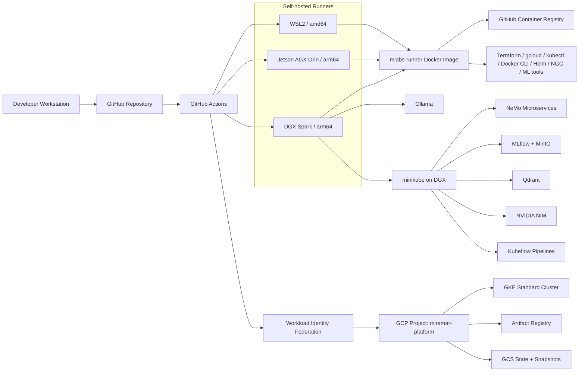

# miramar-platform-gcp

Hybrid on-prem + GCP AI platform for generating, deploying, and operating reproducible AI workload projects across local GPU systems and cloud infrastructure.

> **New here?** Read [SOWHAT.md](SOWHAT.md) — what this repo demonstrates and why it matters.

> **Blog:** [miramar-labs-org.github.io](https://miramar-labs-org.github.io) — project write-ups and lab notes.

> **Dev Workflow:** [DEVELOPER.md](DEVELOPER.md) — branch workflow, PR process, testing strategies, and gotchas.

> **Docs Index:** [docs/index.md](docs/index.md) — source-of-truth map for architecture, workflows, WSL2, SSH, and runbooks.

> **Platform Dashboard:** [miramar-labs-org.github.io/miramar-platform-gcp](https://miramar-labs-org.github.io/miramar-platform-gcp/) — live table of all platform projects.

The platform dashboard tracks generated projects, their repositories, blog write-ups, local paths, and operational actions.

[](https://miramar-labs-org.github.io/miramar-platform-gcp/)



[](https://github.com/miramar-labs-org/miramar-platform-gcp/actions/workflows/gcp-platform-create.yaml)
[](https://github.com/miramar-labs-org/miramar-platform-gcp/actions/workflows/gcp-platform-destroy.yaml)
[](https://github.com/miramar-labs-org/miramar-platform-gcp/actions/workflows/build-mlabs-runner.yml)
[](https://github.com/miramar-labs-org/miramar-platform-gcp/actions/workflows/gke-expand.yaml)
[](https://github.com/miramar-labs-org/miramar-platform-gcp/actions/workflows/gke-restore.yaml)
[](https://github.com/miramar-labs-org/miramar-platform-gcp/actions/workflows/gke-expand-gpu.yaml)
[](https://github.com/miramar-labs-org/miramar-platform-gcp/actions/workflows/gke-restore-gpu.yaml)
[](https://github.com/miramar-labs-org/miramar-platform-gcp/actions/workflows/find-gpu-capacity.yaml)
[](https://github.com/miramar-labs-org/miramar-platform-gcp/actions/workflows/toggle-minikube.yaml)
[](https://github.com/miramar-labs-org/miramar-platform-gcp/actions/workflows/deploy-nim.yaml)
[](https://github.com/miramar-labs-org/miramar-platform-gcp/actions/workflows/undeploy-nim.yaml)
[](https://github.com/miramar-labs-org/miramar-platform-gcp/actions/workflows/deploy-ollama.yaml)
[](https://github.com/miramar-labs-org/miramar-platform-gcp/actions/workflows/undeploy-ollama.yaml)
[](https://github.com/miramar-labs-org/miramar-platform-gcp/actions/workflows/build-kfp-arm64.yaml)
[](https://github.com/miramar-labs-org/miramar-platform-gcp/actions/workflows/deploy-qdrant.yaml)
[](https://github.com/miramar-labs-org/miramar-platform-gcp/actions/workflows/undeploy-qdrant.yaml)
[](https://github.com/miramar-labs-org/miramar-platform-gcp/actions/workflows/deploy-kubeflow.yaml)
[](https://github.com/miramar-labs-org/miramar-platform-gcp/actions/workflows/undeploy-kubeflow.yaml)
[](https://github.com/miramar-labs-org/miramar-platform-gcp/actions/workflows/deploy-nsight-operator.yaml)
[](https://github.com/miramar-labs-org/miramar-platform-gcp/actions/workflows/undeploy-nsight-operator.yaml)
[](https://github.com/miramar-labs-org/miramar-platform-gcp/actions/workflows/create-project.yaml)
[](https://github.com/miramar-labs-org/miramar-platform-gcp/actions/workflows/delete-project.yaml)
[](https://github.com/miramar-labs-org/miramar-platform-gcp/actions/workflows/deploy-dashboard.yaml)
[](https://github.com/miramar-labs-org/miramar-platform-gcp/actions/workflows/provision-wsl2.yaml)
[](https://github.com/miramar-labs-org/miramar-platform-gcp/actions/workflows/verify-ssh-topology.yaml)
[](https://github.com/miramar-labs-org/miramar-platform-gcp/actions/workflows/unprovision-wsl2.yaml)

## Platform Overview

### Physical machines

On-premises machines acting as self-hosted GitHub Actions runners and general compute:

| Machine | OS | Arch | CPU | GPU | VRAM | [CUDA](https://developer.nvidia.com/cuda-toolkit) | Runner label |
| --- | --- | --- | --- | --- | --- | --- | --- |
| Windows laptop | Ubuntu 22.04 ([WSL2](https://github.com/microsoft/WSL)) | x86_64 / amd64 | AMD | NVIDIA GeForce RTX 4060 — Ada Lovelace, 3072 CUDA cores, 96 Tensor Cores (sm_89) | 8 GB GDDR6 | 12.6 | `wsl2` |
| [NVIDIA DGX Spark](https://www.nvidia.com/en-us/products/workstations/dgx-spark/) 128GB | DGX OS (Ubuntu 24.04) | aarch64 / arm64 | 20-core Arm (10× Cortex-X925 + 10× Cortex-A725) | GB10 Superchip — Blackwell, 6144 CUDA cores, 192 Tensor Cores (sm_100, 5th-gen) | 128 GB unified | 13.0 | `dgx` |
| [NVIDIA Jetson AGX Orin](https://www.nvidia.com/en-us/autonomous-machines/embedded-systems/jetson-orin/) 64GB | Ubuntu 22.04 ([JetPack 6.x](https://developer.nvidia.com/embedded/jetpack)) | aarch64 / arm64 | 12-core Cortex-A78AE | Ampere — 2048 CUDA cores, 64 Tensor Cores (sm_87) | 64 GB unified | 12.6 | `agx` |

All three machines run the [mlabs-runner](mlabs-runner/) Docker image — WSL2 pulls `linux/amd64`, DGX and Orin both pull `linux/arm64`. GPU access works the same way on both arm64 machines via the NVIDIA container runtime.

### Cloud infrastructure (GCP)

| Service | Purpose | Dashboard |
| --- | --- | --- |
| [GKE](https://cloud.google.com/kubernetes-engine) Standard cluster (`miramar-shared-gke`) | Shared Kubernetes cluster for platform workloads | [console](https://console.cloud.google.com/kubernetes/list?project=miramar-platform) · [docs](https://cloud.google.com/kubernetes-engine/docs) |
| [Artifact Registry](https://cloud.google.com/artifact-registry) (`apps`) | Docker image registry for built application images | [console](https://console.cloud.google.com/artifacts?project=miramar-platform) · [docs](https://cloud.google.com/artifact-registry/docs) |
| GCS buckets | [Terraform](https://www.terraform.io) state + GKE node pool snapshots (see [docs/gcp.md](docs/gcp.md)) | [console](https://console.cloud.google.com/storage/browser?project=miramar-platform) |
| [Workload Identity Federation](https://cloud.google.com/iam/docs/workload-identity-federation) | Keyless auth from [GitHub Actions](https://github.com/features/actions) to GCP — no long-lived service account keys | [console](https://console.cloud.google.com/iam-admin/workload-identity-pools?project=miramar-platform) |
| GCP project | `miramar-platform` — single project for all resources | [Dashboard](https://console.cloud.google.com/home/dashboard?project=miramar-platform) |

### CI/CD

| Service | Role | Link |
| --- | --- | --- |
| GitHub Actions | Workflow automation — build, test, deploy | [Actions](https://github.com/miramar-labs-org/miramar-platform-gcp/actions) |
| GHCR | Docker image hosting for the runner image and future app images | [Packages](https://github.com/orgs/miramar-labs-org/packages) |
| Self-hosted runners | Jobs requiring GPU, local network access, or aarch64 run on the physical machines above | [Runners](https://github.com/organizations/miramar-labs-org/settings/actions/runners) |

GitHub Actions workflows authenticate to GCP keylessly via Workload Identity Federation. Access is restricted to repos under the `miramar-labs-org` org.

---

## Project Factory

Miramar Platform also acts as a template-based project factory for applied AI workloads.

Project templates generate complete repos with:

| Capability | Included |
| --- | --- |
| Notebook-first development | JupyterLab notebooks as the source of truth |
| CI/CD workflows | GitHub Actions for deploy/undeploy operations |
| Platform integration | Dashboard registration and project lifecycle automation |
| Local execution | DGX/JupyterLab/kernel setup for on-prem development |
| Documentation | README, `CLAUDE.md`, blog draft scaffolding |
| Deployment hooks | Kubeflow, GCP, and local service integration patterns |

The first production template is a **Kubeflow Pipelines fine-tuning project**. It supports on-prem fine-tuning and evaluation where PHI remains local, then promotes only approved PHI-free model artifacts to GCP for inference.

Planned templates include RAG systems, evaluation harnesses, NeMo/NIM workflows, agentic AI projects, and additional clinical AI deployment patterns.

---

## GPU Profiling & AI-Assisted Analysis

Projects scaffolded from the `kfp-ft-eval` template include first-class Nsight Systems profiling
with LLM-assisted interpretation — no manual `.nsys-rep` inspection required.

- **Per-component profiling in KFP** — any pipeline stage can be profiled with a single pod
  label in the pipeline definition. The Nsight Operator (deployed via `deploy-nsight-operator.yaml`)
  intercepts the pod at creation time via a mutating webhook and injects `nsys` automatically —
  no code changes or specialised Docker images required:
  ```python
  kubernetes.add_pod_label(task, "nvidia-nsight-profile", "enabled")
  ```
  **Warning:** Do NOT label the `kubeflow` namespace with `nvidia-nsight-profile=enabled` — it
  injects nsys into ALL pods including KFP's DAG driver pods, which fail with `runAsNonRoot`.
  Use per-pod labels only.

- **AI-assisted interpretation** — `/nsight-interpret` extracts `nsys stats` summaries and sends
  them to an LLM of your choice for structured bottleneck analysis — top GPU utilization gaps, memory transfer
  overhead, NVTX stage breakdown, and prioritized optimization recommendations. Results are saved
  as `analysis-claude.md` alongside the `.nsys-rep` for future reference.

- **GB10 unified memory awareness** — on DGX Spark (Blackwell GB10, 128 GB unified memory), the
  platform automatically handles the cold weight-migration spike that occurs on first GPU access
  after `from_pretrained`, preventing it from contaminating inference timing.

```bash
# Profile baseline eval and interpret results
/kfp-deploy run-NNN --profile-baseline
/nsight-interpret run-NNN
```

Full details: [docs/kfp-skills.md — Nsight Profiling in KFP](docs/kfp-skills.md#nsight-profiling-in-kfp) · [docs/dgx.md — GPU Profiling](docs/dgx.md#gpu-profiling)

---

## Local DGX Stack

DGX Spark runs the local AI stack: [minikube](https://minikube.sigs.k8s.io/), [NeMo Microservices](https://docs.nvidia.com/nemo/microservices/), [MLflow](https://mlflow.org), [Qdrant](https://qdrant.tech), [Kubeflow Pipelines](https://www.kubeflow.org/), [NIM](https://developer.nvidia.com/nim), and [Ollama](https://ollama.com). See [docs/dgx.md](docs/dgx.md) for workflow details and [dgx/README.md](dgx/README.md) for host-level service notes.

Common tunnel:

```sh
ssh -L 8001:localhost:8001 \
    -L 8888:localhost:8888 \
    -L 5000:localhost:5000 \
    -L 8080:localhost:8080 \
    -L 11434:localhost:11434 \
    -L 6333:localhost:6333 \
    -L 6334:localhost:6334 \
    <user>@spark-79b7.local
```

Stack order: **Minikube Install → NeMo Deploy → MLflow Deploy → Qdrant Deploy → Kubeflow Deploy → NIM Deploy**. Ollama is independent of minikube.

---

## Operations Map

Detailed operational procedures live in focused docs:

| Area | Docs |
| --- | --- |
| GitHub secrets, variables, and host env vars | [docs/configuration.md](docs/configuration.md) |
| Self-hosted runner image and launch scripts | [docs/runners.md](docs/runners.md) |
| GCP bootstrap, Terraform, WIF, and state storage | [docs/gcp.md](docs/gcp.md) |
| Workflow catalog | [docs/workflows.md](docs/workflows.md) |
| DGX local AI stack | [docs/dgx.md](docs/dgx.md), [dgx/README.md](dgx/README.md) |
| GPU profiling + AI analysis | [docs/kfp-skills.md](docs/kfp-skills.md#nsight-profiling-in-kfp), [docs/dgx.md](docs/dgx.md#gpu-profiling) |
| WSL2 environments | [wsl2/README.md](wsl2/README.md), [wsl2/TECHNICAL.md](wsl2/TECHNICAL.md) |
| SSH topology | [docs/ssh-runbook.md](docs/ssh-runbook.md) |
| Shared DGX/WSL2 folder | [docs/shared.md](docs/shared.md) |

Common entry points:

| Task | Start here |
| --- | --- |
| Bootstrap GCP once | [docs/gcp.md](docs/gcp.md) |
| Launch local runners | [docs/runners.md](docs/runners.md) |
| Create/destroy platform | [docs/workflows.md](docs/workflows.md) |
| Scale GKE/GPU capacity | [docs/workflows.md](docs/workflows.md), [docs/gpu-quota-request.md](docs/gpu-quota-request.md) |
| Deploy DGX AI services | [docs/dgx.md](docs/dgx.md) |
| Profile a KFP pipeline stage | [docs/kfp-skills.md](docs/kfp-skills.md#nsight-profiling-in-kfp) |
| Provision WSL2 distros | [wsl2/README.md](wsl2/README.md) |
| Troubleshoot SSH | [docs/ssh-runbook.md](docs/ssh-runbook.md) |

## Key Technologies

| Technology | GitHub | Docs |
| --- | --- | --- |
| [minikube](https://minikube.sigs.k8s.io/) | [kubernetes/minikube](https://github.com/kubernetes/minikube) | [docs](https://minikube.sigs.k8s.io/docs/) |
| [Ollama](https://ollama.com) | [ollama/ollama](https://github.com/ollama/ollama) | [API docs](https://github.com/ollama/ollama/blob/main/docs/api.md) |
| [MLflow](https://mlflow.org) | [mlflow/mlflow](https://github.com/mlflow/mlflow) | [docs](https://mlflow.org/docs/latest/index.html) |
| [Qdrant](https://qdrant.tech) | [qdrant/qdrant](https://github.com/qdrant/qdrant) | [docs](https://qdrant.tech/documentation/) |
| [Kubeflow Pipelines](https://www.kubeflow.org/) | [kubeflow/pipelines](https://github.com/kubeflow/pipelines) | [docs](https://www.kubeflow.org/docs/components/pipelines/) |
| [NeMo Microservices](https://docs.nvidia.com/nemo/microservices/) | — | [docs](https://docs.nvidia.com/nemo/microservices/latest/) |
| [NIM](https://developer.nvidia.com/nim) | — | [docs](https://docs.nvidia.com/nim/) |
| [WSL2](https://github.com/microsoft/WSL) | [microsoft/WSL](https://github.com/microsoft/WSL) | [docs](https://learn.microsoft.com/en-us/windows/wsl/) |
| [NVIDIA DGX Spark](https://www.nvidia.com/en-us/products/workstations/dgx-spark/) | — | [developer docs](https://docs.nvidia.com/dgx/index.html) |
| [NVIDIA Jetson AGX Orin](https://www.nvidia.com/en-us/autonomous-machines/embedded-systems/jetson-orin/) | — | [developer docs](https://developer.nvidia.com/embedded/jetpack) |
| [CUDA](https://developer.nvidia.com/cuda-toolkit) | — | [docs](https://docs.nvidia.com/cuda/) |
| [NVIDIA Nsight Operator](https://developer.nvidia.com/nsight-systems) | — | [docs](https://docs.nvidia.com/nsight-systems/nsight-operator/) |
| [JupyterLab](https://jupyter.org) | [jupyterlab/jupyterlab](https://github.com/jupyterlab/jupyterlab) | [docs](https://jupyterlab.readthedocs.io/) |
| [Terraform](https://www.terraform.io) | [hashicorp/terraform](https://github.com/hashicorp/terraform) | [docs](https://developer.hashicorp.com/terraform/docs) |
| [GKE](https://cloud.google.com/kubernetes-engine) | — | [docs](https://cloud.google.com/kubernetes-engine/docs) |
| [Helm](https://helm.sh) | [helm/helm](https://github.com/helm/helm) | [docs](https://helm.sh/docs/) |
| [GitHub Actions](https://github.com/features/actions) | — | [docs](https://docs.github.com/en/actions) |

## Contributing

Branch workflow, PR process, testing strategies, branch protection commands, and secrets setup: see [DEVELOPER.md](DEVELOPER.md).
