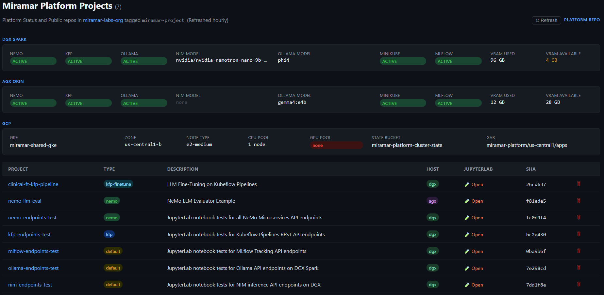
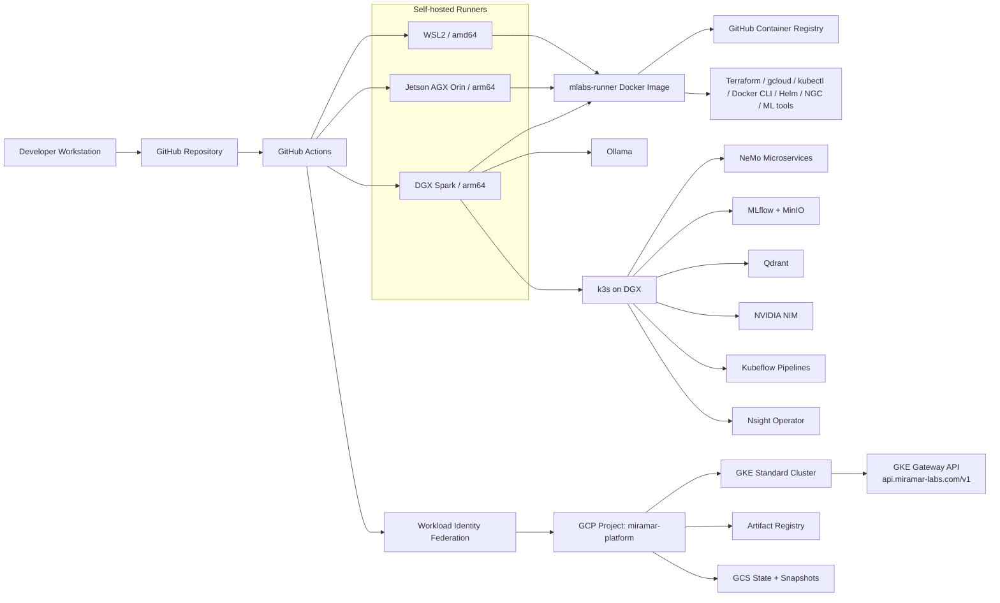

# miramar-platform-gcp

Hybrid on-prem + GCP AI platform for generating, deploying, and operating reproducible AI workload projects across local GPU systems and cloud infrastructure.

> **New here?** Read [SOWHAT.md](SOWHAT.md) — what this repo demonstrates and why it matters.

> **Blog:** [miramar-labs-org.github.io](https://miramar-labs-org.github.io) — project write-ups and lab notes.

> **Dev Workflow:** [docs/development.md](docs/development.md) — branch workflow, PR process, testing strategies, and gotchas.

> **Docs Index:** [docs/index.md](docs/index.md) — source-of-truth map for architecture, workflows, WSL2, SSH, and runbooks.

> **Platform Dashboard:** [miramar-labs-org.github.io/miramar-platform-gcp](https://miramar-labs-org.github.io/miramar-platform-gcp/) — live table of all platform projects.

The platform dashboard tracks generated projects, their repositories, blog write-ups, local paths, and operational actions.

[](https://miramar-labs-org.github.io/miramar-platform-gcp/)



[](https://github.com/miramar-labs-org/miramar-platform-gcp/actions/workflows/gcp-platform-create.yaml)
[](https://github.com/miramar-labs-org/miramar-platform-gcp/actions/workflows/gcp-platform-destroy.yaml)
[](https://github.com/miramar-labs-org/miramar-platform-gcp/actions/workflows/build-mlabs-runner.yml)
[](https://github.com/miramar-labs-org/miramar-platform-gcp/actions/workflows/gke-expand.yaml)
[](https://github.com/miramar-labs-org/miramar-platform-gcp/actions/workflows/gke-restore.yaml)
[](https://github.com/miramar-labs-org/miramar-platform-gcp/actions/workflows/gke-expand-gpu.yaml)
[](https://github.com/miramar-labs-org/miramar-platform-gcp/actions/workflows/gke-restore-gpu.yaml)
[](https://github.com/miramar-labs-org/miramar-platform-gcp/actions/workflows/deploy-gke-gateway.yaml)
[](https://github.com/miramar-labs-org/miramar-platform-gcp/actions/workflows/undeploy-gke-gateway.yaml)
[](https://github.com/miramar-labs-org/miramar-platform-gcp/actions/workflows/find-gpu-capacity.yaml)
[](https://github.com/miramar-labs-org/miramar-platform-gcp/actions/workflows/install-k3s.yaml)
[](https://github.com/miramar-labs-org/miramar-platform-gcp/actions/workflows/deploy-nim.yaml)
[](https://github.com/miramar-labs-org/miramar-platform-gcp/actions/workflows/undeploy-nim.yaml)
[](https://github.com/miramar-labs-org/miramar-platform-gcp/actions/workflows/deploy-ollama.yaml)
[](https://github.com/miramar-labs-org/miramar-platform-gcp/actions/workflows/undeploy-ollama.yaml)
[](https://github.com/miramar-labs-org/miramar-platform-gcp/actions/workflows/build-kfp-arm64.yaml)
[](https://github.com/miramar-labs-org/miramar-platform-gcp/actions/workflows/deploy-qdrant.yaml)
[](https://github.com/miramar-labs-org/miramar-platform-gcp/actions/workflows/undeploy-qdrant.yaml)
[](https://github.com/miramar-labs-org/miramar-platform-gcp/actions/workflows/deploy-kubeflow.yaml)
[](https://github.com/miramar-labs-org/miramar-platform-gcp/actions/workflows/undeploy-kubeflow.yaml)
[](https://github.com/miramar-labs-org/miramar-platform-gcp/actions/workflows/deploy-nsight-operator.yaml)
[](https://github.com/miramar-labs-org/miramar-platform-gcp/actions/workflows/undeploy-nsight-operator.yaml)
[](https://github.com/miramar-labs-org/miramar-platform-gcp/actions/workflows/create-project.yaml)
[](https://github.com/miramar-labs-org/miramar-platform-gcp/actions/workflows/delete-project.yaml)
[](https://github.com/miramar-labs-org/miramar-platform-gcp/actions/workflows/deploy-dashboard.yaml)
[](https://github.com/miramar-labs-org/miramar-platform-gcp/actions/workflows/provision-wsl2.yaml)
[](https://github.com/miramar-labs-org/miramar-platform-gcp/actions/workflows/verify-ssh-topology.yaml)
[](https://github.com/miramar-labs-org/miramar-platform-gcp/actions/workflows/unprovision-wsl2.yaml)

## Platform Overview

### Physical machines

On-premises machines acting as self-hosted GitHub Actions runners and general compute:

| Machine                                                                                                       | OS                                                                          | Arch            | CPU                                             | GPU                                                                              | VRAM           | [CUDA](https://developer.nvidia.com/cuda-toolkit) | Runner label |
| ------------------------------------------------------------------------------------------------------------- | --------------------------------------------------------------------------- | --------------- | ----------------------------------------------- | -------------------------------------------------------------------------------- | -------------- | ------------------------------------------------- | ------------ |
| Windows laptop                                                                                                | Ubuntu 22.04 ([WSL2](https://github.com/microsoft/WSL))                     | x86_64 / amd64  | AMD                                             | NVIDIA GeForce RTX 4060 — Ada Lovelace, 3072 CUDA cores, 96 Tensor Cores (sm_89) | 8 GB GDDR6     | 12.6                                              | `wsl2`       |
| [NVIDIA DGX Spark](https://www.nvidia.com/en-us/products/workstations/dgx-spark/) 128GB                       | DGX OS (Ubuntu 24.04)                                                       | aarch64 / arm64 | 20-core Arm (10× Cortex-X925 + 10× Cortex-A725) | GB10 Superchip — Blackwell, 6144 CUDA cores, 192 Tensor Cores (sm_100, 5th-gen)  | 128 GB unified | 13.0                                              | `dgx`        |
| [NVIDIA Jetson AGX Orin](https://www.nvidia.com/en-us/autonomous-machines/embedded-systems/jetson-orin/) 64GB | Ubuntu 22.04 ([JetPack 6.x](https://developer.nvidia.com/embedded/jetpack)) | aarch64 / arm64 | 12-core Cortex-A78AE                            | Ampere — 2048 CUDA cores, 64 Tensor Cores (sm_87)                                | 64 GB unified  | 12.6                                              | `agx`        |

All three machines run the [mlabs-runner](mlabs-runner/) Docker image — WSL2 pulls `linux/amd64`, DGX and Orin both pull `linux/arm64`. GPU access works the same way on both arm64 machines via the NVIDIA container runtime.

### Cloud infrastructure (GCP)

| Service                                                                                        | Purpose                                                                                                             | Dashboard                                                                                                                                      |
| ---------------------------------------------------------------------------------------------- | ------------------------------------------------------------------------------------------------------------------- | ---------------------------------------------------------------------------------------------------------------------------------------------- |
| [GKE](https://cloud.google.com/kubernetes-engine) Standard cluster (`miramar-shared-gke`)      | Shared Kubernetes cluster for platform workloads                                                                    | [console](https://console.cloud.google.com/kubernetes/list?project=miramar-platform) · [docs](https://cloud.google.com/kubernetes-engine/docs) |
| [Artifact Registry](https://cloud.google.com/artifact-registry) (`apps`)                       | Docker image registry for built application images                                                                  | [console](https://console.cloud.google.com/artifacts?project=miramar-platform) · [docs](https://cloud.google.com/artifact-registry/docs)       |
| GCS buckets                                                                                    | [Terraform](https://www.terraform.io) state + GKE node pool snapshots (see [docs/gcp.md](docs/gcp.md))              | [console](https://console.cloud.google.com/storage/browser?project=miramar-platform)                                                           |
| [Workload Identity Federation](https://cloud.google.com/iam/docs/workload-identity-federation) | Keyless auth from [GitHub Actions](https://github.com/features/actions) to GCP — no long-lived service account keys | [console](https://console.cloud.google.com/iam-admin/workload-identity-pools?project=miramar-platform)                                         |
| GCP project                                                                                    | `miramar-platform` — single project for all resources                                                               | [Dashboard](https://console.cloud.google.com/home/dashboard?project=miramar-platform)                                                          |

### CI/CD

| Service             | Role                                                                                    | Link                                                                                  |
| ------------------- | --------------------------------------------------------------------------------------- | ------------------------------------------------------------------------------------- |
| GitHub Actions      | Workflow automation — build, test, deploy                                               | [Actions](https://github.com/miramar-labs-org/miramar-platform-gcp/actions)           |
| GHCR                | Docker image hosting for the runner image and future app images                         | [Packages](https://github.com/orgs/miramar-labs-org/packages)                         |
| Self-hosted runners | Jobs requiring GPU, local network access, or aarch64 run on the physical machines above | [Runners](https://github.com/organizations/miramar-labs-org/settings/actions/runners) |

GitHub Actions workflows authenticate to GCP keylessly via Workload Identity Federation. Access is restricted to repos under the `miramar-labs-org` org.

---

## Project Factory

Miramar Platform also acts as a template-based project factory for applied AI workloads.

Project templates generate complete repos with:

| Capability                 | Included                                                |
| -------------------------- | ------------------------------------------------------- |
| Notebook-first development | JupyterLab notebooks as the source of truth             |
| CI/CD workflows            | GitHub Actions for deploy/undeploy operations           |
| Platform integration       | Dashboard registration and project lifecycle automation |
| Local execution            | DGX/JupyterLab/kernel setup for on-prem development     |
| Documentation              | README, `CLAUDE.md`, blog draft scaffolding             |
| Deployment hooks           | Kubeflow, GCP, and local service integration patterns   |

Live templates:

| Type | Purpose |
| ---- | ------- |
| `ft-eval` | Eval-first LoRA fine-tuning — 8-stage KFP pipeline (prepare → baseline\_eval → fine\_tune → post\_finetune\_eval → safety\_eval → deployment\_gate); training and PHI stay on DGX |
| `nemo-ft-eval` | Same arc via NeMo Customizer backend — NeMo catalog model IDs, `nemo2hf` checkpoint export, NeMo safety eval |
| `kfp` | Blank KFP v2 pipeline scaffold with GPU stage stub, MLflow tracking, and Nsight profiling label |
| `kfp-rag` | RAG pipeline — ingest\_documents → retrieval\_eval → generation\_eval → faithfulness\_eval → safety\_eval → deployment\_gate; Qdrant-backed, LLM-as-judge, CPU-only |
| `kfp-nemo-curator` | NeMo Curator data-curation pipeline — extract\_text → quality\_filter → deduplication → pii\_redaction → curator\_report; CPU + GPU (RAPIDS cuDF) |
| `serving-vllm` | vLLM + LoRA adapter serving on DGX/AGX (K3s) or GKE L4 spot — consumes the adapter bundle published by a `ft-eval` project |
| `serving-nim` | Stock NGC NIM model serving on DGX/AGX (K3s) or GKE L4 spot |
| `serving-llm-nim` | Multi-LLM NIM runtime — local or HuggingFace model source auto-detected; GPU protection pattern (auto-undeploy active serving project) |
| `serving-trt-fp8` | FP8-quantized checkpoint served via vLLM (`--quantization=fp8`) on DGX/AGX (K3s) or GKE L4 spot |
| `serving-trt-engine` | Compiled TRT-LLM engine served via `tensorrt_llm.serve` on DGX/AGX (K3s) or GKE L4 spot; per-arch engine mapping (gb10/sm87/l4) |
| `serving-triton-vllm` | Triton Inference Server + vLLM Python backend on DGX (K3s) or GKE L4 spot; LoRA adapter support; LiteLLM `triton/model` provider; NOT AGX |
| `serving-triton-trtllm` | Triton Inference Server + TRT-LLM Python backend on DGX (K3s) or GKE L4 spot; GPU-arch engine baked at build time (`engine_gb10/` DGX, `engine_l4/` GKE); ~30s cold start; NOT AGX |

Templates form a complete fine-tune → serve arc. PHI stays on DGX throughout; only approved, gate-passed model artifacts cross to GCP.

---

## GPU Profiling & AI-Assisted Analysis

Projects scaffolded from the `ft-eval` template include first-class Nsight Systems profiling
with LLM-assisted interpretation — no manual `.nsys-rep` inspection required.

- **Per-component profiling in KFP** — any pipeline stage can be profiled with a single pod
  label in the pipeline definition. The Nsight Operator (deployed via `deploy-nsight-operator.yaml`)
  intercepts the pod at creation time via a mutating webhook and injects `nsys` automatically —
  no code changes or specialised Docker images required:
  ```python
  kubernetes.add_pod_label(task, "nvidia-nsight-profile", "enabled")
  ```

- **AI-assisted interpretation** — `/nsight-interpret` extracts `nsys stats` summaries and sends
  them to an LLM of your choice for structured bottleneck analysis — top GPU utilization gaps, memory transfer
  overhead, NVTX stage breakdown, and prioritized optimization recommendations. Results are saved
  as `analysis-claude.md` alongside the `.nsys-rep` for future reference.

- **GB10 unified memory awareness** — on DGX Spark (Blackwell GB10, 128 GB unified memory), the
  platform automatically handles the cold weight-migration spike that occurs on first GPU access
  after `from_pretrained`, preventing it from contaminating inference timing.

```bash
# Profile baseline eval and interpret results
/kfp-deploy run-NNN --profile-baseline
/nsight-interpret run-NNN
```

Full details: [docs/kfp-skills.md — Nsight Profiling in KFP](docs/kfp-skills.md#nsight-profiling-in-kfp) · [docs/dgx.md — GPU Profiling](docs/dgx.md#gpu-profiling)

---

## Model Serving

After a `ft-eval` run passes the deployment gate, the adapter is published to GCS and served via vLLM on GKE:

```
ft-eval run PASS
  → publish-adapter.yaml  (dgx)  → gs://miramar-platform-ft-adapters/<project>/<run>/
      manifest.json               ↓
      adapter/               deploy.yaml  (wsl2, GKE L4 spot)
      eval/                       ↓
      model_card.md          vLLM pod  →  OpenAI-compatible /v1/chat/completions
      smoke_test_prompts.jsonl    (stable alias: served_model_name)
```

### Serving arc stages

| Stage                                                    | Template                                  | Status         |
| -------------------------------------------------------- | ----------------------------------------- | -------------- |
| 1 — Fine-tune + eval gate                                | `ft-eval`                                 | ✅ Implemented |
| 1 — Publish adapter bundle to GCS                        | `publish-adapter.yaml` (in `ft-eval`)     | ✅ Implemented |
| 2 — Serve via vLLM + LoRA adapter (DGX/AGX/GKE)         | `serving-vllm`                            | ✅ Implemented |
| 3 — Serve via NIM (DGX/AGX/GKE)                         | `serving-nim`                             | ✅ Implemented |
| 4 — Serve FP8-quantized checkpoint via vLLM (DGX/AGX/GKE) | `serving-trt-fp8`                       | ✅ Implemented |
| 5 — Serve compiled TRT-LLM engine (DGX/AGX/GKE)         | `serving-trt-engine`                      | ✅ Implemented |
| 6 — Model router service (stable `/v1` API, multi-model) | `deploy-model-router.yaml` (platform svc) | ✅ Implemented |
| 7 — GKE Gateway API route (`https://api.miramar-labs.com/v1`) | `deploy-gke-gateway.yaml` / `undeploy-gke-gateway.yaml` | ✅ Implemented |
| 8 — Serve via Triton + vLLM backend                      | `serving-triton-vllm`                     | ✅ Implemented |
| 9 — Serve via Triton + TensorRT-LLM backend              | `serving-triton-trtllm`                   | ✅ Implemented |

Key properties:
- **Manifest gate** — `deploy.yaml` reads `manifest.json` and blocks if `eval_passed` or `safety_passed` is false
- **Stable alias** — clients use `served_model_name` (e.g. `biomistral-onc`), never raw model paths
- **Cost control** — L4 spot GPU pool (~$0.22/hr) is expanded on deploy and torn down on undeploy; never left running
- **PHI boundary** — training, eval, and publish all run on DGX; only approved non-PHI artifacts reach GCP

```bash
# After gate PASS on the FT project:
gh workflow run publish-adapter.yaml --field run_name=run-001

# In the serving project:
gh workflow run build-push.yaml
gh workflow run deploy.yaml --field manifest_uri=gs://miramar-platform-ft-adapters/.../manifest.json

# Test:
kubectl port-forward svc/vllm 8000:8000 -n <project>
curl http://localhost:8000/v1/models

# Always undeploy when done:
gh workflow run undeploy.yaml
```

Full details: [docs/workflows.md — Model Serving](docs/workflows.md#model-serving-serving--projects)

---

## Local DGX Stack

DGX Spark runs the local AI stack: [k3s](https://k3s.io/), [NeMo Microservices](https://docs.nvidia.com/nemo/microservices/), [MLflow](https://mlflow.org), [Qdrant](https://qdrant.tech), [Kubeflow Pipelines](https://www.kubeflow.org/), [NIM](https://developer.nvidia.com/nim), and [Ollama](https://ollama.com). See [docs/dgx.md](docs/dgx.md) for workflow details and [dgx/README.md](dgx/README.md) for host-level service notes.

Common tunnel:

```sh
ssh -L 8001:localhost:8001 \
    -L 8888:localhost:8888 \
    -L 5000:localhost:5000 \
    -L 8080:localhost:8080 \
    -L 11434:localhost:11434 \
    -L 6333:localhost:6333 \
    -L 6334:localhost:6334 \
    -L 8889:localhost:8889 \
    <user>@spark-79b7.local
```

Stack order:
- **DGX:** K3s Install → NeMo Deploy → MLflow Deploy → Qdrant Deploy → Kubeflow Deploy → NIM Deploy (or Ollama Deploy)
- **AGX:** K3s Install → NeMo Deploy → MLflow Deploy → Qdrant Deploy → Kubeflow Deploy → Ollama Deploy

Ollama runs as a host systemd service (independent of k3s) on both machines.

---

## Operations Map

Detailed operational procedures live in focused docs:

| Area                                             | Docs                                                                                                       |
| ------------------------------------------------ | ---------------------------------------------------------------------------------------------------------- |
| GitHub secrets, variables, and host env vars     | [docs/configuration.md](docs/configuration.md)                                                             |
| Self-hosted runner image and launch scripts      | [docs/runners.md](docs/runners.md)                                                                         |
| GCP bootstrap, Terraform, WIF, and state storage | [docs/gcp.md](docs/gcp.md)                                                                                 |
| Workflow catalog                                 | [docs/workflows.md](docs/workflows.md)                                                                     |
| DGX local AI stack                               | [docs/dgx.md](docs/dgx.md), [dgx/README.md](dgx/README.md)                                                 |
| GPU profiling + AI analysis                      | [docs/kfp-skills.md](docs/kfp-skills.md#nsight-profiling-in-kfp), [docs/dgx.md](docs/dgx.md#gpu-profiling) |
| Model serving (vLLM on GKE)                      | [docs/workflows.md](docs/workflows.md#model-serving-llm-serving-vllm-projects)                             |
| WSL2 environments                                | [wsl2/README.md](wsl2/README.md), [wsl2/TECHNICAL.md](wsl2/TECHNICAL.md)                                   |
| SSH topology                                     | [docs/ssh-runbook.md](docs/ssh-runbook.md)                                                                 |
| Shared DGX/WSL2 folder                           | [docs/shared.md](docs/shared.md)                                                                           |

Common entry points:

| Task                           | Start here                                                                                     |
| ------------------------------ | ---------------------------------------------------------------------------------------------- |
| Bootstrap GCP once             | [docs/gcp.md](docs/gcp.md)                                                                     |
| Launch local runners           | [docs/runners.md](docs/runners.md)                                                             |
| Create/destroy platform        | [docs/workflows.md](docs/workflows.md)                                                         |
| Scale GKE/GPU capacity         | [docs/workflows.md](docs/workflows.md), [docs/gpu-quota-request.md](docs/gpu-quota-request.md) |
| Deploy DGX AI services         | [docs/dgx.md](docs/dgx.md)                                                                     |
| Profile a KFP pipeline stage   | [docs/kfp-skills.md](docs/kfp-skills.md#nsight-profiling-in-kfp)                               |
| Publish adapter + serve on GKE | [docs/workflows.md](docs/workflows.md#model-serving-llm-serving-vllm-projects)                 |
| Provision WSL2 distros         | [wsl2/README.md](wsl2/README.md)                                                               |
| Troubleshoot SSH               | [docs/ssh-runbook.md](docs/ssh-runbook.md)                                                     |

## Key Technologies

| Technology                                                                                               | GitHub                                                                  | Docs                                                               |
| -------------------------------------------------------------------------------------------------------- | ----------------------------------------------------------------------- | ------------------------------------------------------------------ |
| [k3s](https://k3s.io/)                                                                                   | [k3s-io/k3s](https://github.com/k3s-io/k3s)                             | [docs](https://docs.k3s.io/)                                       |
| [Ollama](https://ollama.com)                                                                             | [ollama/ollama](https://github.com/ollama/ollama)                       | [API docs](https://github.com/ollama/ollama/blob/main/docs/api.md) |
| [MLflow](https://mlflow.org)                                                                             | [mlflow/mlflow](https://github.com/mlflow/mlflow)                       | [docs](https://mlflow.org/docs/latest/index.html)                  |
| [Qdrant](https://qdrant.tech)                                                                            | [qdrant/qdrant](https://github.com/qdrant/qdrant)                       | [docs](https://qdrant.tech/documentation/)                         |
| [Kubeflow Pipelines](https://www.kubeflow.org/)                                                          | [kubeflow/pipelines](https://github.com/kubeflow/pipelines)             | [docs](https://www.kubeflow.org/docs/components/pipelines/)        |
| [NeMo Microservices](https://docs.nvidia.com/nemo/microservices/)                                        | —                                                                       | [docs](https://docs.nvidia.com/nemo/microservices/latest/)         |
| [NeMo Curator](https://docs.nvidia.com/nemo/curator/)                                                    | [NVIDIA/NeMo-Curator](https://github.com/NVIDIA/NeMo-Curator)           | [docs](https://docs.nvidia.com/nemo/curator/latest/)               |
| [NIM](https://developer.nvidia.com/nim)                                                                  | —                                                                       | [docs](https://docs.nvidia.com/nim/)                               |
| [WSL2](https://github.com/microsoft/WSL)                                                                 | [microsoft/WSL](https://github.com/microsoft/WSL)                       | [docs](https://learn.microsoft.com/en-us/windows/wsl/)             |
| [NVIDIA DGX Spark](https://www.nvidia.com/en-us/products/workstations/dgx-spark/)                        | —                                                                       | [developer docs](https://docs.nvidia.com/dgx/index.html)           |
| [NVIDIA Jetson AGX Orin](https://www.nvidia.com/en-us/autonomous-machines/embedded-systems/jetson-orin/) | —                                                                       | [developer docs](https://developer.nvidia.com/embedded/jetpack)    |
| [CUDA](https://developer.nvidia.com/cuda-toolkit)                                                        | —                                                                       | [docs](https://docs.nvidia.com/cuda/)                              |
| [NVIDIA Nsight Operator](https://docs.nvidia.com/nsight-operator/)                                       | —                                                                       | [docs](https://docs.nvidia.com/nsight-operator/)                   |
| [JupyterLab](https://jupyter.org)                                                                        | [jupyterlab/jupyterlab](https://github.com/jupyterlab/jupyterlab)       | [docs](https://jupyterlab.readthedocs.io/)                         |
| [Terraform](https://www.terraform.io)                                                                    | [hashicorp/terraform](https://github.com/hashicorp/terraform)           | [docs](https://developer.hashicorp.com/terraform/docs)             |
| [GKE](https://cloud.google.com/kubernetes-engine)                                                        | —                                                                       | [docs](https://cloud.google.com/kubernetes-engine/docs)            |
| [Google Cloud Storage](https://cloud.google.com/storage)                                                 | —                                                                       | [docs](https://cloud.google.com/storage/docs)                      |
| [Google Artifact Registry](https://cloud.google.com/artifact-registry)                                   | —                                                                       | [docs](https://cloud.google.com/artifact-registry/docs)            |
| [Hugging Face Transformers](https://huggingface.co/docs/transformers)                                    | [huggingface/transformers](https://github.com/huggingface/transformers) | [docs](https://huggingface.co/docs/transformers)                   |
| [TRL](https://huggingface.co/docs/trl)                                                                   | [huggingface/trl](https://github.com/huggingface/trl)                   | [docs](https://huggingface.co/docs/trl)                            |
| [Hugging Face Datasets](https://huggingface.co/docs/datasets)                                            | [huggingface/datasets](https://github.com/huggingface/datasets)         | [docs](https://huggingface.co/docs/datasets)                       |
| [PEFT](https://huggingface.co/docs/peft)                                                                 | [huggingface/peft](https://github.com/huggingface/peft)                 | [docs](https://huggingface.co/docs/peft)                           |
| [vLLM](https://docs.vllm.ai/)                                                                            | [vllm-project/vllm](https://github.com/vllm-project/vllm)               | [docs](https://docs.vllm.ai/)                                      |
| [NVIDIA Triton Inference Server](https://developer.nvidia.com/triton-inference-server)                   | [triton-inference-server/server](https://github.com/triton-inference-server/server) | [docs](https://docs.nvidia.com/deeplearning/triton-inference-server/user-guide/) |
| [TensorRT-LLM](https://nvidia.github.io/TensorRT-LLM/)                                                  | [NVIDIA/TensorRT-LLM](https://github.com/NVIDIA/TensorRT-LLM)           | [docs](https://nvidia.github.io/TensorRT-LLM/)                     |
| [LiteLLM](https://www.litellm.ai/)                                                                       | [BerriAI/litellm](https://github.com/BerriAI/litellm)                   | [docs](https://docs.litellm.ai/)                                   |
| [Open WebUI](https://openwebui.com/)                                                                     | [open-webui/open-webui](https://github.com/open-webui/open-webui)       | [docs](https://docs.openwebui.com/)                                |
| [GKE Gateway API](https://cloud.google.com/kubernetes-engine/docs/concepts/gateway-api)                  | —                                                                       | [docs](https://cloud.google.com/kubernetes-engine/docs/concepts/gateway-api) |
| [Weights & Biases](https://wandb.ai)                                                                     | [wandb/wandb](https://github.com/wandb/wandb)                           | [docs](https://docs.wandb.ai/)                                     |
| [Helm](https://helm.sh)                                                                                  | [helm/helm](https://github.com/helm/helm)                               | [docs](https://helm.sh/docs/)                                      |
| [GitHub Actions](https://github.com/features/actions)                                                    | —                                                                       | [docs](https://docs.github.com/en/actions)                         |

## Contributing

Branch workflow, PR process, testing strategies, branch protection commands, and secrets setup: see [docs/development.md](docs/development.md).
