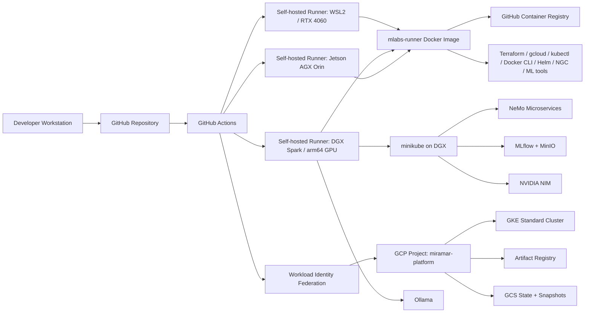

# Miramar Platform GCP

**Hybrid on-prem + GCP infrastructure for GPU-enabled AI development, CI/CD, and platform operations.**

This repository demonstrates a hands-on AI platform architecture that connects local GPU machines, Dockerized self-hosted GitHub Actions runners, Terraform-managed GCP infrastructure, and Kubernetes-based AI/ML services.

It is designed to show practical platform engineering for modern AI workloads: not just model code, but the infrastructure needed to build, test, deploy, and operate GPU-aware systems across local and cloud environments.

---

## What this demonstrates

- **Hybrid AI infrastructure** across local GPU hardware and Google Cloud Platform.
- **Self-hosted GitHub Actions runners** packaged as a reusable multi-architecture Docker image.
- **GPU-capable CI/CD** using NVIDIA CUDA base images and host GPU passthrough.
- **Terraform-managed GCP infrastructure**, including GKE, Artifact Registry, GCS state, and Workload Identity Federation.
- **Keyless GitHub Actions authentication to GCP** using Workload Identity Federation rather than long-lived service account keys.
- **On-prem Kubernetes operations** on NVIDIA DGX Spark using minikube.
- **AI/ML service deployment workflows** for NeMo, NIM, MLflow, and Ollama.
- **Repository quality automation** using Terraform fmt/validate, ShellCheck, shfmt, yamllint, actionlint, Hadolint, and Prettier.
- **Cross-platform runner support** for x86_64/amd64 and aarch64/arm64 machines.

---

## Architecture at a glance



---

## Why this repo matters

Many AI demos stop at notebooks or local inference scripts. This repository focuses on the platform layer: the CI/CD, runners, cloud resources, Kubernetes workflows, image builds, and operational glue needed to make AI systems repeatable.

The project shows the ability to design and implement infrastructure across several practical boundaries:

| Boundary | What this repo shows |
|---|---|
| Local ↔ Cloud | DGX/minikube and GCP/GKE are both part of the platform. |
| x86 ↔ ARM | Runner images support both `linux/amd64` and `linux/arm64`. |
| CPU CI ↔ GPU CI | Self-hosted runners can access host NVIDIA GPUs. |
| Manual ops ↔ Workflow automation | GHA workflows handle create/destroy/deploy/update operations. |
| Long-lived credentials ↔ Keyless auth | GCP access uses Workload Identity Federation. |
| Prototype ↔ Platform | Tooling is packaged into reusable runner images and workflows. |

---

## Core components

### 1. Multi-architecture GitHub Actions runner image

The `mlabs-runner` image is a Dockerized self-hosted GitHub Actions runner built for both `amd64` and `arm64`.

It includes platform and AI tooling such as:

- Docker CLI
- kubectl
- Google Cloud CLI
- Terraform
- GitHub CLI
- Helm
- NVIDIA NGC CLI
- Python / pip
- PyTorch
- Hugging Face ecosystem libraries
- MLflow
- ONNX tooling
- repo quality tools: ShellCheck, shfmt, yamllint, actionlint, Hadolint, Prettier

This allows workflows to run consistently across local hardware without reinstalling tooling at job runtime.

### 2. Hybrid runner fleet

The platform is designed around physical machines acting as GitHub Actions runners:

| Machine type | Role |
|---|---|
| Windows laptop with WSL2 + RTX GPU | General x86_64 CI and GPU-capable local jobs |
| NVIDIA DGX Spark | Local arm64 GPU workloads and Kubernetes services |
| Jetson AGX Orin | Edge-style arm64 GPU runner target |

The same runner container concept is used across architectures.

### 3. GCP infrastructure

The `gcp/terraform` directory provisions the cloud foundation for the platform:

- GKE Standard cluster
- Artifact Registry repository
- GCS-backed state/snapshots
- GCP project configuration
- Workload Identity Federation integration for GitHub Actions

This creates a realistic cloud deployment target while keeping authentication keyless.

### 4. DGX-local Kubernetes services

The DGX side of the platform runs local Kubernetes services via minikube, including:

- NeMo Microservices
- MLflow tracking
- MinIO-backed artifact storage
- NVIDIA NIM deployment workflows
- supporting systemd services and port-forwarding helpers

This demonstrates a practical split between local GPU infrastructure and cloud-hosted deployment targets.

### 5. Workflow-driven operations

The `.github/workflows` directory contains operational workflows for:

- building and publishing the runner image
- creating and destroying platform infrastructure
- expanding/restoring GKE capacity
- finding GPU capacity
- installing/uninstalling/toggling minikube
- deploying/undeploying NeMo
- deploying/undeploying NIM
- deploying/undeploying MLflow
- deploying/undeploying/updating Ollama
- provisioning/unprovisioning WSL2
- running manual repo quality checks

The repo is structured to make platform operations reproducible from GitHub Actions rather than relying only on ad hoc terminal commands.

---

## Repo quality and engineering hygiene

This repository includes a manually triggered quality workflow:

```text
.github/workflows/repo-quality-manual.yaml
```

The workflow checks:

- Terraform formatting
- Terraform validation
- shell script formatting
- shell linting
- YAML linting
- GitHub Actions workflow linting
- Dockerfile linting
- Markdown/YAML/JSON formatting via Prettier

It also supports a `fix_mode` option for running formatters in write mode and showing the resulting diff.

This is important because infrastructure repositories are judged not just by whether they work, but by whether they are reviewable, maintainable, and safe to change.

---

## Repository map

```text
.
├── .github/workflows/      # CI/CD and platform operation workflows
├── dgx/                    # DGX-local services, systemd units, and minikube support
├── docs/                   # Supporting platform documentation
├── gcp/terraform/          # Terraform-managed GCP infrastructure
├── mlabs-runner/           # Multi-arch self-hosted GHA runner Docker image
├── scripts/                # Bootstrap, GitHub Actions, GCP, and runner scripts
├── wsl2/                   # WSL2 runner provisioning support
├── README.md               # Detailed operational runbook
└── README2.md              # Hiring-manager / portfolio landing page
```

---

## Skills demonstrated

### AI infrastructure

- GPU-aware CI/CD
- CUDA-enabled runner containers
- NVIDIA tooling integration
- local AI service orchestration
- MLflow / NeMo / NIM / Ollama workflows
- hybrid local/cloud model platform design

### Cloud and platform engineering

- Terraform
- GCP
- GKE
- Artifact Registry
- GCS
- Workload Identity Federation
- Kubernetes
- Docker
- GitHub Actions
- self-hosted runner design

### DevOps and reliability

- reproducible runner images
- manual and automated lifecycle workflows
- infrastructure validation
- linting and formatting gates
- secrets/variables separation
- idempotent launch scripts
- operational documentation

---

## Intended audience

This repo is intended for reviewers looking for evidence of hands-on work in:

- AI platform engineering
- infrastructure engineering
- DevOps / CI/CD
- cloud-native deployment
- GPU systems integration
- hybrid on-prem/cloud architecture
- practical Kubernetes operations

It is not just a sample app. It is a platform repository that shows how AI workloads can be supported across local GPU hardware, GitHub Actions, Docker, Kubernetes, and GCP.

---

## Quick evaluation guide

A reviewer can inspect the repo in this order:

1. **Start with this file** for the portfolio-level summary.
2. Read `README.md` for operational details.
3. Open `mlabs-runner/Dockerfile` to see the self-hosted runner image.
4. Open `.github/workflows/repo-quality-manual.yaml` to see repo hygiene automation.
5. Open `.github/workflows/build-mlabs-runner.yml` to see runner image publication.
6. Open `gcp/terraform/` to review the GCP foundation.
7. Open `dgx/` to review the local Kubernetes/DGX side of the platform.

---

## Status

This is an active platform engineering repository for the Miramar Labs AI Platform.

The current emphasis is on building a working hybrid foundation: local GPU runners, DGX-local services, GCP deployment targets, GitHub Actions automation, and quality checks. Future improvements can include deeper environment separation, more formal module boundaries, expanded observability, and an architecture diagram rendered as an image for the main README.
