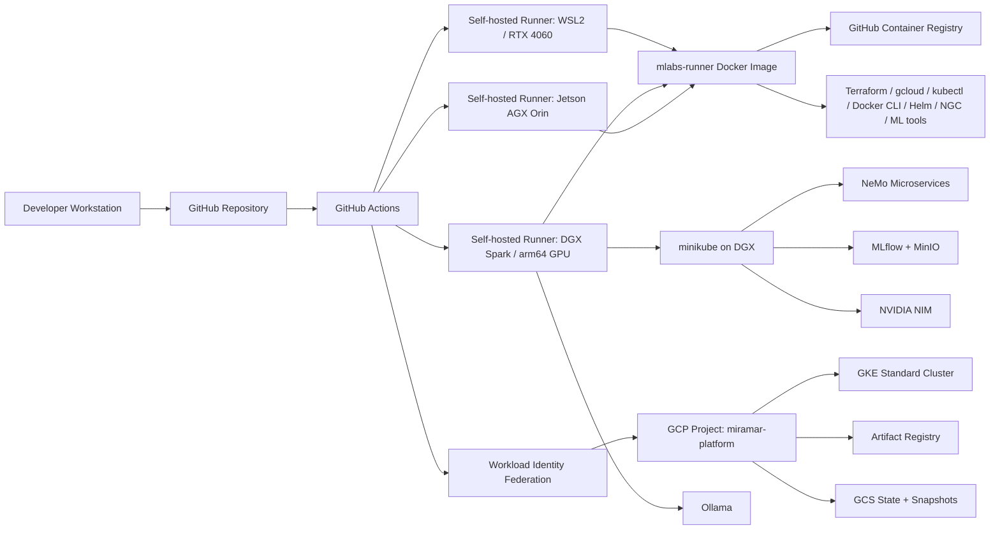

# Miramar Platform GCP

**Hybrid on-prem + GCP infrastructure for GPU-enabled AI development, CI/CD, and platform operations.**

Infrastructure and tooling for an AI platform that spans local GPU hardware, Dockerized self-hosted GitHub Actions runners, Terraform-managed GCP resources, and Kubernetes-based AI/ML services.

---

## What this demonstrates

- **Hybrid AI infrastructure** across local GPU hardware and Google Cloud Platform.
- **Self-hosted GitHub Actions runners** packaged as a reusable multi-architecture Docker image.
- **GPU-capable CI/CD** using NVIDIA CUDA base images and host GPU passthrough.
- **Terraform-managed GCP infrastructure** — GKE, Artifact Registry, GCS state, and Workload Identity Federation.
- **Keyless GCP authentication** via Workload Identity Federation — no long-lived service account keys.
- **On-prem Kubernetes** on NVIDIA DGX Spark via minikube.
- **AI/ML service workflows** for NeMo, NIM, MLflow, and Ollama.
- **Repo quality automation** — Terraform fmt/validate, ShellCheck, shfmt, yamllint, actionlint, Hadolint, and Prettier.
- **Cross-platform support** for `linux/amd64` and `linux/arm64`.

---

## Architecture at a glance



---

## Why this repo

Most AI demos stop at notebooks or local inference scripts. This repo focuses on the platform layer: CI/CD, runners, cloud resources, Kubernetes workflows, image builds, and operational glue needed to make AI systems repeatable.

| Boundary | What this repo shows |
|---|---|
| Local ↔ Cloud | DGX/minikube and GCP/GKE are both part of the platform. |
| x86 ↔ ARM | Runner images support both `linux/amd64` and `linux/arm64`. |
| CPU CI ↔ GPU CI | Self-hosted runners access host NVIDIA GPUs directly. |
| Manual ops ↔ Workflow automation | GHA workflows handle create/destroy/deploy/update operations. |
| Long-lived credentials ↔ Keyless auth | GCP access uses Workload Identity Federation. |
| Prototype ↔ Platform | Tooling is packaged into reusable runner images and workflows. |

---

## Core components

### 1. Multi-architecture runner image (`mlabs-runner`)

Dockerized self-hosted GitHub Actions runner built for both `amd64` and `arm64`. Pre-installed tooling: Docker CLI, kubectl, gcloud, Terraform, GitHub CLI, Helm, NGC CLI, Python/pip, PyTorch, Hugging Face libraries, MLflow, ONNX tooling, and repo quality tools (ShellCheck, shfmt, yamllint, actionlint, Hadolint, Prettier).

### 2. Hybrid runner fleet

| Machine | Role |
|---|---|
| Windows laptop / WSL2 + RTX GPU | General x86_64 CI and GPU-capable local jobs |
| NVIDIA DGX Spark | arm64 GPU workloads and Kubernetes services |
| Jetson AGX Orin | Edge-style arm64 runner target |

### 3. GCP infrastructure (`gcp/terraform/`)

GKE Standard cluster, Artifact Registry, GCS-backed state/snapshots, and Workload Identity Federation for keyless GitHub Actions → GCP auth.

### 4. DGX-local Kubernetes services

minikube cluster on the DGX Spark running NeMo Microservices, MLflow tracking, MinIO artifact storage, and NVIDIA NIM — with supporting systemd services and port-forward helpers.

### 5. Workflow-driven operations

`workflow_dispatch` workflows covering: runner image builds, platform create/destroy, GKE expand/restore (standard and GPU), GPU capacity probing, minikube lifecycle, NeMo/NIM/MLflow/Ollama deploy/undeploy, WSL2 provisioning, and repo quality checks.

---

## Repo quality

`.github/workflows/repo-quality-manual.yaml` gates on Terraform fmt/validate, ShellCheck, shfmt, yamllint, actionlint, Hadolint, and Prettier. Supports a `fix_mode` option that auto-formats and shows the resulting diff.

---

## Repository map

```text
.
├── .github/workflows/      # CI/CD and platform operation workflows
├── dgx/                    # DGX-local services, systemd units, and minikube support
├── docs/                   # Supporting platform documentation
├── gcp/terraform/          # Terraform-managed GCP infrastructure
├── mlabs-runner/           # Multi-arch self-hosted GHA runner Docker image
├── scripts/                # Bootstrap, GitHub Actions, GCP, and runner scripts
├── wsl2/                   # WSL2 runner provisioning support
└── README.md               # Detailed operational runbook
```

---

## Skills

**AI infrastructure** — GPU-aware CI/CD, CUDA runner containers, NVIDIA tooling integration, local AI service orchestration, MLflow / NeMo / NIM / Ollama workflows, hybrid local/cloud platform design

**Cloud & platform engineering** — Terraform, GCP, GKE, Artifact Registry, GCS, Workload Identity Federation, Kubernetes, Docker, GitHub Actions, self-hosted runner design

**DevOps & reliability** — reproducible runner images, lifecycle workflows, infrastructure validation, linting gates, secrets/variables separation, idempotent scripts, operational documentation

---

## Quick evaluation guide

1. **This file** — portfolio summary.
2. `README.md` — operational runbook.
3. `mlabs-runner/Dockerfile` — runner image.
4. `.github/workflows/repo-quality-manual.yaml` — repo hygiene automation.
5. `.github/workflows/build-mlabs-runner.yml` — image publication.
6. `gcp/terraform/` — GCP foundation.
7. `dgx/` — local Kubernetes/DGX services.

---

*Active repository. See `README.md` for full operational details.*
