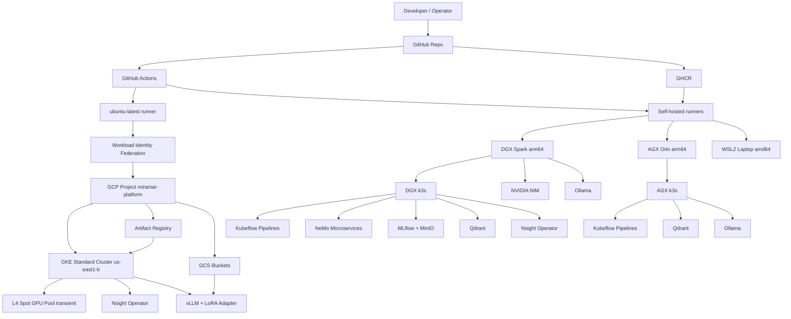

# Miramar Platform Architecture

Hybrid on-premises + GCP AI platform for running fine-tuning, evaluation, and
inference workloads across local GPU systems and cloud infrastructure.

---

## Goals

- Run GPU-heavy fine-tuning, evaluation, and local AI services on owned hardware (DGX Spark, AGX Orin).
- Use GitHub Actions as the common control plane for all lifecycle operations.
- Use Google Cloud for shared Kubernetes, vLLM inference serving, artifact storage, and Terraform state.
- Enforce a hard PHI boundary: all training and evaluation stays on DGX; only approved non-PHI model artifacts reach GCP.
- Support both `amd64` and `arm64` hosts through one multi-architecture runner image.

---

## Platform implemented / planned

| Capability                                       | Status         | Notes                                                                  |
| ------------------------------------------------ | -------------- | ---------------------------------------------------------------------- |
| Multi-arch runner image (`mlabs-runner`)         | ✅ Done        | `linux/amd64` + `linux/arm64`; GHCR                                    |
| DGX k3s cluster                                  | ✅ Done        | NVIDIA device plugin, nginx-ingress, CoreDNS patch                     |
| AGX k3s cluster                                  | ✅ Done        | Same image as DGX; AGX currently offline                               |
| NeMo Microservices (DGX)                         | ✅ Done        | `nemo-microservices` namespace; exposes `nemo.test` / `nim.test`       |
| Kubeflow Pipelines (DGX + AGX)                   | ✅ Done        | Native arm64 images built and patched                                  |
| MLflow + MinIO (DGX + AGX)                       | ✅ Done        | `mlflow-system` namespace; port-forwarded at `:5000`                   |
| Qdrant vector DB (DGX + AGX)                     | ✅ Done        | `qdrant-system` namespace; REST `:6333`, gRPC `:6334`                  |
| NIM inference (DGX)                              | ✅ Done        | Blackwell-optimised models; auto-swap and rollback                     |
| Ollama (DGX + AGX)                               | ✅ Done        | Host systemd service; up to 100 GB model budget on DGX                 |
| Nsight Operator (DGX)                            | ✅ Done        | Helm (NGC devtools); UI port-forwarded at `:8889`                      |
| Nsight Operator (AGX)                            | ✅ Done        | Inactive until AGX comes back online                                   |
| Nsight Operator (GKE)                            | ✅ Done        | Auto-installed by Platform Create; no persistent port-forward          |
| GKE Standard cluster                             | ✅ Done        | `e2-standard-4`, single node, `us-east1-b`                             |
| GKE transient GPU pool                           | ✅ Done        | L4 on-demand (`g2-standard-8`), `us-east1-b`; expand/restore workflow pair |
| ft-eval pipeline type                            | ✅ Done        | 6-step eval-first fine-tuning; config-driven; MLflow tracking          |
| kfp-rag pipeline type                            | ✅ Done        | 6-step RAG pipeline; Qdrant-backed; LLM-as-judge eval; CPU-only        |
| kfp-nemo-curator pipeline type                        | ✅ Done        | 6-step NeMo Curator data-curation; CPU+GPU (RAPIDS cuDF dedup)         |
| Adapter publish → GCS manifest                   | ✅ Done        | `publish-adapter.yaml`; `eval_passed` + `safety_passed` gate           |
| vLLM LoRA adapter serving (DGX/AGX/GKE)          | ✅ Done        | `serving-vllm` template; LoRA adapter baked into image; L4 spot on GKE |
| NIM serving (DGX/AGX/GKE)                        | ✅ Done        | `serving-nim` template; stock NGC NIM images; nvcr-pull secret         |
| FP8-quantized vLLM serving (DGX/AGX/GKE)         | ✅ Done        | `serving-trt-fp8` template; `--quantization=fp8` via vLLM              |
| TRT-LLM engine serving (DGX/AGX/GKE)             | ✅ Done        | `serving-trt-engine` template; `tensorrt_llm.serve`; per-arch engines  |
| Model router service (K3s)                       | ✅ Done        | LiteLLM proxy in `model-router` ns; single `/v1` across multiple backends; `deploy-model-router.yaml` |
| Triton + vLLM serving (DGX/GKE)                 | ✅ Done        | `serving-triton-vllm` template; Triton Python backend; AsyncLLMEngine; LoRA support |
| Triton + TRT-LLM serving (DGX/GKE)              | ✅ Done        | `serving-triton-trtllm` template; Triton Python backend; synchronous TRT-LLM LLM API; baked engine |
| Platform dashboard (GitHub Pages)                | ✅ Done        | Hourly refresh; per-machine service badges; project table              |
| Nsight profiling of vLLM serving                 | 📋 Planned     | Profile vLLM on GKE L4 via Nsight Operator pod injection               |
| Inference optimization pipeline (`kfp-optimize`) | 📋 Planned     | Prune → distill → quantize (FP8) on DGX; KFP pipeline type             |
| AGX back online                                  | 📋 Planned     | Waiting on hardware                                                    |

---

## Major components

| Layer                | Component                                            | Responsibility                                                   |
| -------------------- | ---------------------------------------------------- | ---------------------------------------------------------------- |
| Source control       | GitHub repository                                    | Workflows, Terraform, runner image, scripts, platform docs       |
| CI/CD control plane  | GitHub Actions                                       | Lifecycle workflows for all platform operations                  |
| Runner substrate     | `mlabs-runner` Docker image                          | Common toolchain for self-hosted execution across WSL2, DGX, AGX |
| Local GPU systems    | DGX Spark (128 GB unified), AGX Orin (64 GB unified) | GPU fine-tuning, evaluation, local AI services                   |
| Local Kubernetes     | DGX/AGX k3s                                          | NeMo, KFP, MLflow, Qdrant, Nsight Operator                       |
| Cloud Kubernetes     | GKE Standard (`e2-standard-4`)                       | vLLM inference serving; Nsight Operator                          |
| Transient GPU pool   | GKE L4 spot (`g2-standard-8`)                        | Brought up per-deploy, torn down after smoke test                |
| vLLM serving         | GKE L4 + LoRA init container                         | Loads base model + adapter from GCS manifest at startup          |
| Artifact storage     | GHCR + GCP Artifact Registry                         | Runner images; serving container images                          |
| Model artifact store | GCS (`miramar-platform-ft-adapters`)                 | LoRA adapters + `manifest.json` gating artifacts                 |
| State storage        | GCS (`miramar-platform-cluster-state`)               | Terraform state; GKE node-pool quota snapshots                   |
| Experiment tracking  | MLflow (DGX)                                         | Fine-tuning runs, eval metrics, model registry                   |
| Vector database      | Qdrant (DGX/AGX)                                     | Embeddings and retrieval for local AI services                   |
| Cloud authentication | Workload Identity Federation                         | Keyless GitHub Actions → GCP auth                                |
| Observability        | Nsight Operator (DGX/AGX/GKE)                        | CUDA/NVTX profiling via pod injection; UI at `:8889`             |
| Platform dashboard   | GitHub Pages                                         | Live service badges, project table, create/delete controls       |

---

## Fine-tune → Serve arc

The primary ML workflow is a pipeline from raw model to optimised production inference.
Stages 1–2 are the current implemented arc; Stage 3 is the planned optimisation path.

```
+------------------------------------------------------------------------+
|                        DGX Spark (PHI boundary)                        |
|                                                                        |
|  Stage 1: Fine-tune + Eval       Stage 3 (planned): Optimize           |
|  -------------------------       ---------------------------           |
|  ft-eval (KFP pipeline)          kfp-optimize (KFP pipeline)           |
|  prepare -> baseline_eval        prune -> distill -> quantize FP8      |
|  -> fine_tune -> post_eval       (Model-Optimizer + Megatron)          |
|  -> safety_eval -> gate          output: quantized merged checkpoint   |
|         |                                     |                        |
|         v                                     v                        |
|  Stage 1b: Publish adapter       Stage 3b: Publish checkpoint          |
|  publish-adapter.yaml            publish-adapter.yaml (same gate)      |
|  eval_passed + safety_passed     eval_passed + safety_passed           |
+--------+-----------------------------------------+--------------------+
         |  LoRA adapter + manifest -> GCS          |  quantized ckpt -> local / GCS
         v                                          v
+------------------------------------------------------------------------+
|                  DGX/AGX (K3s) + GKE L4 spot                          |
|                                                                        |
|  Stage 2a: vLLM Serve (serving-vllm)                                  |
|  vLLM + LoRA init container; OpenAI-compatible API                     |
|                                                                        |
|  Stage 2b: NIM Serve (serving-nim)                                     |
|  Stock NGC NIM image; no build step; nvcr-pull secret                  |
|                                                                        |
|  Stage 2c: FP8 vLLM Serve (serving-trt-fp8)                           |
|  vLLM --quantization=fp8; hostPath on DGX/AGX, GAR image on GKE       |
|                                                                        |
|  Stage 2d: TRT-LLM Engine Serve (serving-trt-engine)                  |
|  tensorrt_llm.serve; per-arch engines (gb10/sm87/l4)                   |
|  L4 spot (expand / restore) on GKE; K3s on DGX/AGX                    |
|                                                                        |
|  Stage 2e: Triton + vLLM (serving-triton-vllm)                        |
|  Triton Python backend; AsyncLLMEngine in background thread; LoRA      |
|  DGX K3s (GHCR) + GKE L4 spot (GAR); NOT AGX                          |
|                                                                        |
|  Stage 2f: Triton + TRT-LLM (serving-triton-trtllm)                   |
|  Triton Python backend; synchronous TRT-LLM LLM API; baked engine      |
|  engine_l4 (GKE) / engine_gb10 (DGX); ~30s cold start; NOT AGX        |
+------------------------------------------------------------------------+
```

**PHI boundary**: PHI never leaves DGX. Only approved non-PHI model artifacts
(`manifest.json`, LoRA adapter weights, quantized checkpoints) are pushed to GCS.
The GCS manifest carries `eval_passed` and `safety_passed` flags — `deploy.yaml`
will refuse to serve any artifact that failed either gate.

---

## Control plane flow



---

## Deployment domains

### Local domain (DGX + AGX)

Owned GPU hardware. All PHI workloads stay here. Self-hosted runners
(`dgx`, `agx`) manage local Kubernetes via `kubectl` and Helm.

| Service               | Namespace            | DGX port | AGX port |
| --------------------- | -------------------- | -------- | -------- |
| Kubernetes Dashboard  | —                    | 8001     | 8002     |
| JupyterLab            | —                    | 8888     | 8887     |
| Kubeflow Pipelines UI | `kubeflow`           | 8080     | 8081     |
| KFP REST API          | `kubeflow`           | 8890     | 8891     |
| NeMo / NIM            | `nemo-microservices` | 8082     | 8083     |
| MLflow                | `mlflow-system`      | 5000     | 5001     |
| Qdrant REST           | `qdrant-system`      | 6333     | 6335     |
| Qdrant gRPC           | `qdrant-system`      | 6334     | 6336     |
| Ollama                | host systemd         | 11434    | 11435    |
| Nsight Operator UI    | `nsight-operator`    | 8889     | 8892     |

All services are reached via SSH tunnels from the laptop (Bitvise profiles in `win/`).

### Cloud domain (GKE)

GKE Standard cluster `miramar-shared-gke` in `us-east1-b`. Minimised for cost:
single `e2-standard-4` node, no `LoadBalancer` services, no Cloud NAT.

GPU workloads use a **transient L4 spot pool** (`g2-standard-8`, `nvidia-l4`):
expanded immediately before a serving deploy, torn down after smoke tests pass.

Access to running GKE services requires `kubectl port-forward` — no persistent tunnels.

### GitHub domain

GitHub is the source-of-truth control plane:
- Repo content defines workflows, Terraform, scripts, and templates.
- GitHub Actions triggers all operational workflows.
- GHCR stores the multi-arch `mlabs-runner` image.
- Org-level variables (`{MACHINE}_{SERVICE}_ACTIVE`, `GKE_*`) drive the platform dashboard.

---

## Project types

| Type                 | Topic tag                      | Host badge      | Status         | Description                                                                              |
| -------------------- | ------------------------------ | --------------- | -------------- | ---------------------------------------------------------------------------------------- |
| `ft-eval`            | `miramar-ft-eval`              | dgx / agx       | ✅ Done        | 6-step eval-first fine-tuning + eval pipeline (KFP v2)                                   |
| `serving-vllm`       | `miramar-llm-serving-vllm`     | dgx / agx / gcp | ✅ Done        | vLLM + LoRA adapter serving on DGX/AGX (K3s) or GKE L4 spot                             |
| `serving-nim`        | `miramar-serving-nim`          | dgx / agx / gcp | ✅ Done        | Stock NGC NIM model serving on DGX/AGX (K3s) or GKE L4 spot                             |
| `serving-trt-fp8`    | `miramar-serving-trt-fp8`      | dgx / agx / gcp | ✅ Done        | FP8-quantized checkpoint served via vLLM on DGX/AGX (K3s) or GKE L4 spot                |
| `serving-trt-engine`      | `miramar-serving-trt-engine`       | dgx / agx / gcp | ✅ Done    | Compiled TRT-LLM engine served via `tensorrt_llm.serve` on DGX/AGX (K3s) or GKE L4 spot |
| `serving-triton-vllm`     | `miramar-serving-triton-vllm`      | dgx / gcp       | ✅ Done    | Triton Python backend + vLLM AsyncLLMEngine; LoRA adapter; DGX K3s or GKE L4 spot (no AGX) |
| `serving-triton-trtllm`   | `miramar-serving-triton-trtllm`    | dgx / gcp       | ✅ Done    | Triton Python backend + TRT-LLM LLM API; baked engine (engine_gb10/engine_l4); ~30s start; no AGX |
| `kfp-rag`            | `miramar-kfp-rag`              | dgx             | ✅ Done        | RAG pipeline: ingest_documents → retrieval_eval → generation_eval → faithfulness_eval → safety_eval → deployment_gate (CPU-only, Qdrant, LLM-as-judge) |
| `kfp-nemo-curator`        | `miramar-kfp-nemo-curator`          | dgx             | ✅ Done        | NeMo Curator data-curation: preflight_check → extract_text → quality_filter → deduplication → pii_redaction → curator_report (CPU + GPU via RAPIDS cuDF) |
| `kfp-optimize`       | `miramar-kfp-optimize`         | dgx             | 📋 Planned     | Prune → distill → quantize FP8 pipeline (KFP v2); output: merged quantized checkpoint    |
| `kfp`                | `miramar-kfp`                  | dgx / agx       | ✅ Done        | Generic KFP v2 pipeline stub                                                             |
| `nemo-ft-eval`       | `miramar-nemo-ft-eval`         | dgx / agx       | ✅ Done        | NeMo Customizer fine-tuning + eval pipeline (parity with ft-eval, `export_adapter` stage) |
| `default`            | `miramar-default`              | dgx / agx       | ✅ Done        | Generic notebook + platform endpoint reference                                           |

---

## Workflow categories

| Category               | Runner                | Examples                                                         |
| ---------------------- | --------------------- | ---------------------------------------------------------------- |
| GCP platform lifecycle | `ubuntu-latest` (WIF) | Platform Create/Destroy, GKE Expand/Restore, GPU pool            |
| Nsight Operator (GKE)  | `ubuntu-latest` (WIF) | Deploy/Undeploy Nsight Operator on GKE                           |
| Runner image build     | `ubuntu-latest`       | Build + push multi-arch `mlabs-runner` to GHCR                   |
| Local k3s lifecycle    | `dgx` / `agx`         | K3s Install/Uninstall                                            |
| Local AI services      | `dgx` / `agx`         | NeMo, KFP, MLflow, Qdrant, Nsight Operator deploy/undeploy       |
| NIM / Ollama           | `dgx` / `agx`         | Deploy, undeploy, model swap with rollback                       |
| Project lifecycle      | `dgx` / `agx`         | Create Project, Delete Project                                   |
| vLLM serving           | `ubuntu-latest` (WIF) | build-push, deploy (expand GPU → rollout → smoke test), undeploy |
| Adapter publish        | `dgx`                 | publish-adapter.yaml — eval gate → GCS manifest                  |
| Dashboard              | `ubuntu-latest`       | Deploy GitHub Pages dashboard (hourly + on state-change)         |

---

## PHI boundary

All fine-tuning, evaluation, and optimisation runs on DGX. The only artifacts
that cross to GCP are:

- LoRA adapter weights (non-PHI, model parameters only)
- `manifest.json` (metadata: eval scores, safety flags, run ID)

PHI never leaves DGX under any circumstances. When real clinical data is
involved, any LLM judge must also run locally on DGX — not via external APIs.

---

## Design tradeoffs

- **Self-hosted runners for local GPU work** — the only way to reach DGX/AGX hardware and local network services.
- **`ubuntu-latest` for all GCP ops** — avoids dependency on self-hosted runner availability for cloud operations; Terraform installed via `hashicorp/setup-terraform@v3`.
- **Transient GPU pool** — eliminates idle GPU spend; L4 spot at ~$0.22/hr is only active during a deploy/test cycle.
- **Single shared GCP project** — keeps cloud setup simple; appropriate for a lab/platform environment.
- **No LoadBalancer services on GKE** — keeps costs minimal; port-forward is sufficient for current workloads.
- **DGX k3s for local AI** — keeps the full stack close to local GPUs and local storage without cloud egress.

---

## Related docs

- [Workflow catalog](workflows.md)
- [GCP provisioning](gcp.md)
- [DGX local AI stack](dgx.md)
- [SSH topology and tunnels](ssh-runbook.md)
- [Repository README](../README.md)
