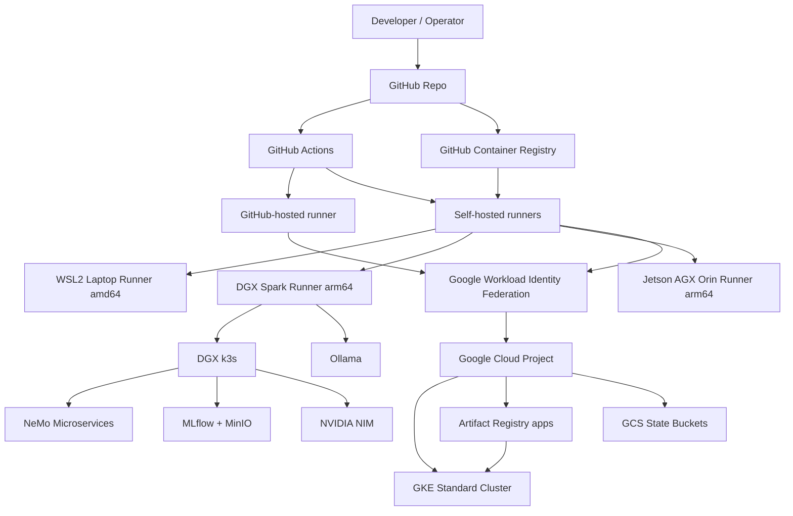

# Miramar Platform Architecture

This document describes the current high-level architecture of the Miramar Labs hybrid AI platform. The platform combines local GPU systems, self-hosted GitHub Actions runners, Kubernetes on the DGX Spark, and Google Cloud infrastructure managed through Terraform.

## Goals

- Run GPU-heavy development, evaluation, and local AI services on owned hardware.
- Use GitHub Actions as the common control plane for repeatable operations.
- Use Google Cloud for shared Kubernetes, artifact hosting, Terraform state, and cloud-side platform workloads.
- Keep sensitive local workloads and local network access on self-hosted runners rather than public hosted runners.
- Support both `amd64` and `arm64` hosts through one multi-architecture runner image.

## Major components

| Layer | Component | Responsibility |
|---|---|---|
| Source control | GitHub repository | Stores Terraform, workflows, runner image, scripts, and platform docs. |
| CI/CD control plane | GitHub Actions | Runs lifecycle workflows for GCP, GKE, k3s, NeMo, NIM, MLflow, Ollama, and runner image builds. |
| Runner substrate | `mlabs-runner` Docker image | Provides common tooling for self-hosted workflow execution across WSL2, DGX Spark, and Jetson/Orin hosts. |
| Local GPU systems | WSL2 laptop, DGX Spark, Jetson AGX Orin | Provide GPU execution, local Kubernetes, local AI services, and architecture coverage. |
| Local Kubernetes | DGX k3s | Runs local AI platform services such as NeMo Microservices, MLflow, NIM, and related support components. |
| Cloud Kubernetes | GKE Standard | Provides shared GCP-hosted Kubernetes capacity for platform and application workloads. |
| Artifact storage | GHCR and GCP Artifact Registry | Stores runner images and application/container artifacts. |
| State storage | GCS | Stores Terraform state and GKE node-pool state/snapshots. |
| Cloud authentication | Workload Identity Federation | Allows GitHub Actions to authenticate to GCP without long-lived service account keys. |

## Control plane flow

## Deployment domains

### Local domain

The local domain is made up of physical machines controlled by the operator. These systems are used for GPU workloads, local Kubernetes operations, and workflows that require direct access to local services or local network addresses.

Current local targets include:

- WSL2 laptop runner for `amd64` testing and orchestration.
- DGX Spark runner for local GPU workloads and DGX k3s management.
- Jetson AGX Orin runner for `arm64` and edge-style GPU coverage.

### Cloud domain

The cloud domain is the Google Cloud project. It provides shared platform resources that are easier to operate as managed services:

- GKE Standard cluster for cloud Kubernetes workloads.
- Artifact Registry repository for application images.
- GCS buckets for Terraform state and cluster/node-pool snapshots.
- IAM and Workload Identity Federation for keyless GitHub Actions authentication.

### GitHub domain

GitHub is the source-of-truth control plane for automation:

- Repository content defines workflows, Terraform, scripts, and runner image configuration.
- GitHub Actions triggers operational workflows.
- GHCR stores the multi-architecture `mlabs-runner` image.
- Self-hosted runner registration determines where jobs execute.

## Workflow categories

| Category | Examples | Execution target |
|---|---|---|
| Platform lifecycle | Create/destroy GCP platform, expand/restore GKE | GitHub Actions with GCP WIF. |
| Runner image lifecycle | Build/publish `mlabs-runner` multi-arch image | GitHub Actions with Buildx/QEMU. |
| Local Kubernetes lifecycle | Install and uninstall DGX k3s | DGX self-hosted runner. |
| AI service lifecycle | Deploy/undeploy NeMo, NIM, MLflow, Ollama updates | DGX self-hosted runner and local Kubernetes. |
| Capacity discovery | Find GPU capacity in GCP zones | GitHub Actions and GCP APIs. |

## Runtime boundaries

- GitHub Actions is the orchestration layer, not the runtime for long-running AI services.
- Local services run on the DGX or local Kubernetes and are reached through SSH tunnels or local network paths.
- Cloud workloads run on GKE and use GCP-native identity and artifact services.
- The runner container provides a consistent toolchain, but the host machine still supplies GPU drivers, NVIDIA container runtime support, network access, and local credentials/environment variables.

## Operational sequence

A typical full local AI stack deployment follows this order:

1. Start or verify the DGX self-hosted runner.
2. Build or pull the current `mlabs-runner` image.
3. Install or verify DGX k3s.
4. Deploy NeMo Microservices.
5. Deploy MLflow after NeMo is available.
6. Deploy NIM workloads as needed.
7. Open SSH tunnels for web UIs such as MLflow or Kubernetes Dashboard.

A typical GCP platform lifecycle follows this order:

1. Bootstrap or verify Workload Identity Federation and required service accounts.
2. Sync GitHub Actions variables from Terraform variables.
3. Run Terraform-backed platform create workflow.
4. Build and push application images to Artifact Registry.
5. Deploy workloads to GKE.
6. Use expand/restore workflows to change node pool capacity when needed.

## Design tradeoffs

This repository is intentionally optimized for a hands-on hybrid lab/platform environment rather than a fully managed enterprise platform. Some decisions are deliberate:

- Self-hosted runners are used to reach local GPUs and local networks.
- A single shared GCP project keeps cloud setup simple.
- The runner image is broad and tool-heavy so operational workflows can share a common execution environment.
- DGX k3s keeps the local AI stack close to local GPUs and local storage.

Future production hardening should focus on environment separation, private GKE networking, policy-as-code, image signing, vulnerability scanning, and stricter least-privilege boundaries.

## Related docs

- [Security model](security-model.md)
- [System flows and diagrams](diagrams.md)
- [Repository README](../README.md)
