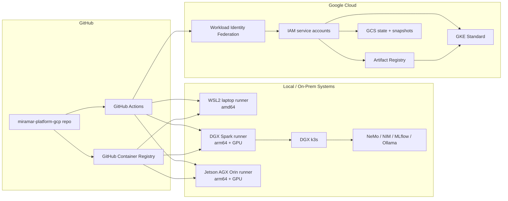
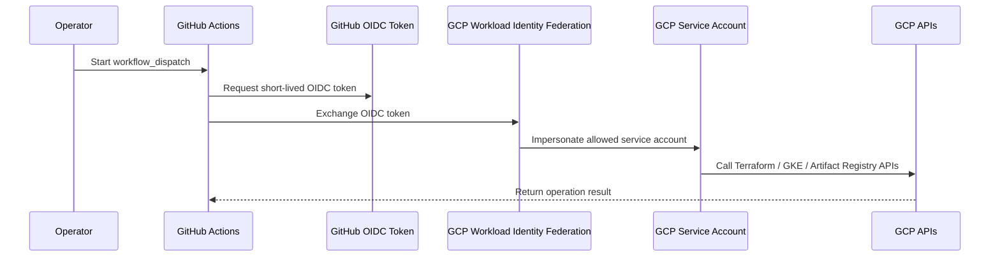
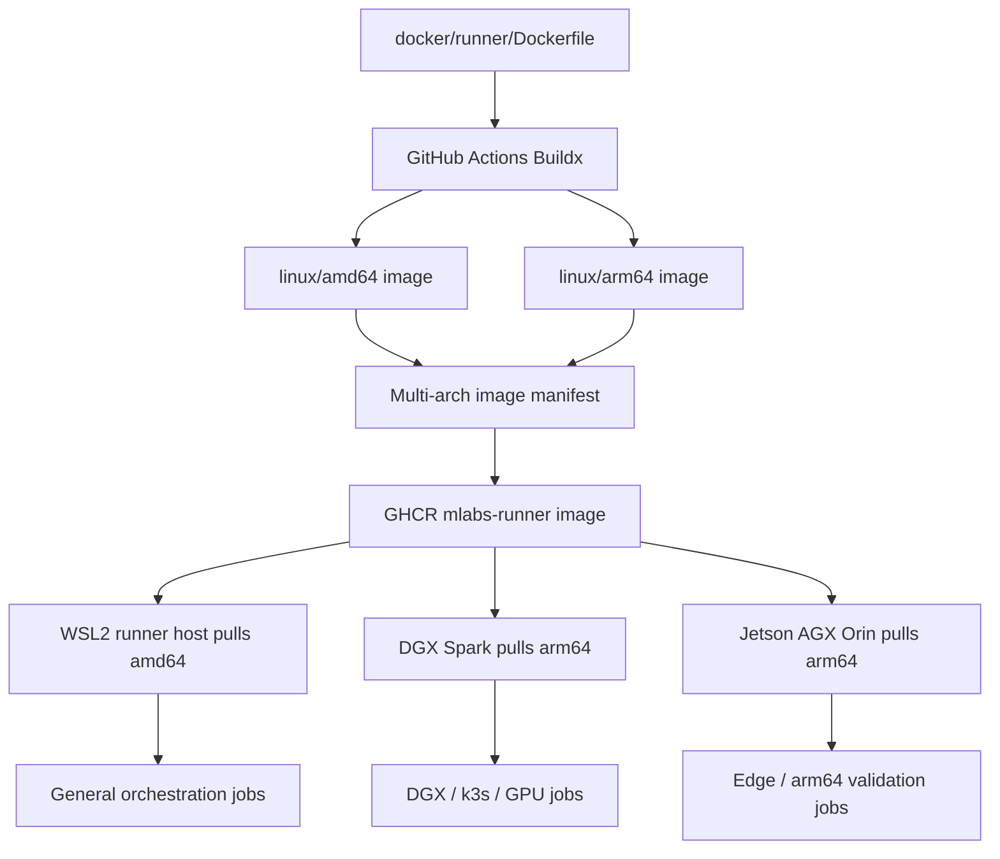
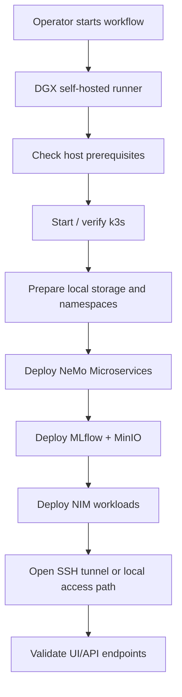
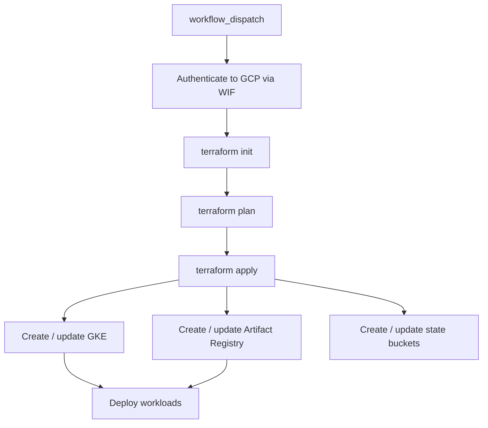
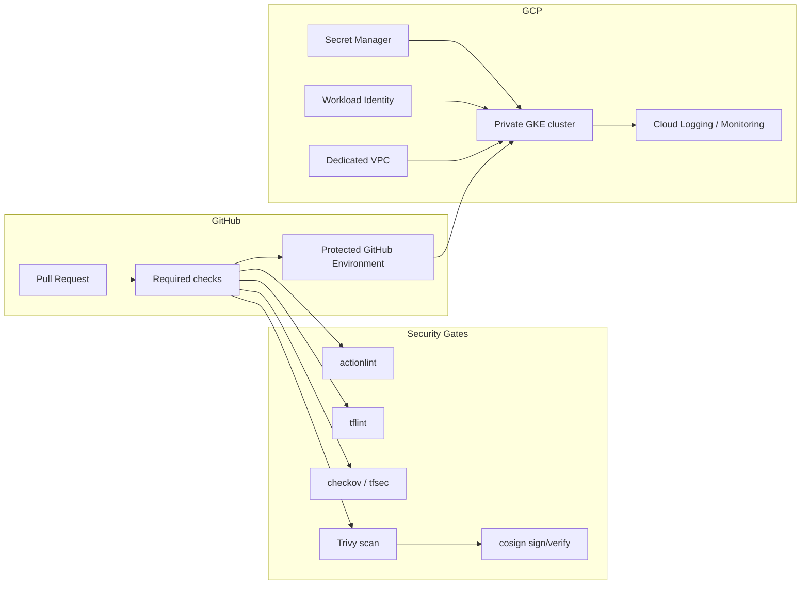

# System Flows and Diagrams

This document contains Mermaid diagrams for the Miramar Labs hybrid AI platform. GitHub renders Mermaid diagrams directly in Markdown.

## Hybrid platform overview

## GitHub Actions to GCP identity flow

## Runner image build and consumption

## Local AI service lifecycle

## GCP platform lifecycle

## Recommended future production topology

## Diagram maintenance notes

- Keep diagrams focused on system responsibilities rather than implementation minutiae.
- Prefer stable component names that match README and workflow names.
- Update this file when new runner hosts, registries, or major platform services are added.
- If a diagram becomes too dense, split it into lifecycle-specific diagrams.
